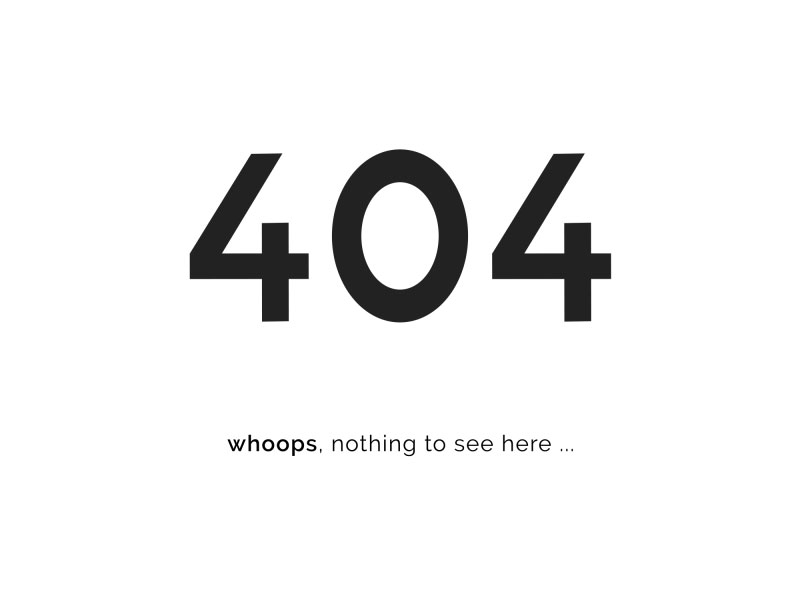

## Potser la pàgina que esteu després s'ha mogut o canviat de nom :(

  

    Si us plau, torneu-ho a provar utilitzant la <strong style="color: #4a3b30; font-size: 20px;">a sobre  barra de navegació</strong>
  

{ group="404"}

  

    El codi d'estat de resposta d'error del client <strong style="color: red;">404</strong> <strong>No trobat</strong> indica que el servidor no pot trobar el recurs sol·licitat.
    Aquests enllaços que porten a una pàgina 404 sovint s'anomenen enllaços trencats o morts i poden estar subjectes a la podridura dels enllaços.
  

