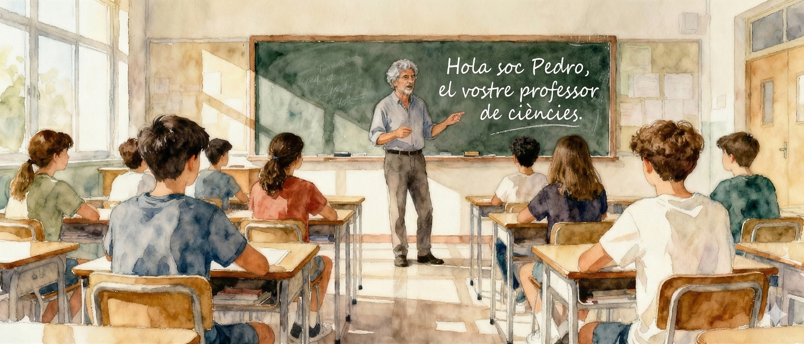
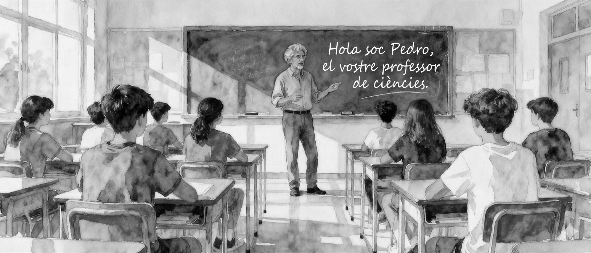

<div style="display: flex; gap: 2em; align-items: stretch; justify-content: space-between;">
<div style="flex: 50%;">

::: {.light-content}
{}
:::

::: {.dark-content}
{}
:::
</div>
<div style="flex: 50%;">
Hola, em dic Pedro i estic estudiant un màster de magisteri de secundària a la Universitat Pompeu Fabra. Aquest web és un registre del meu procés d'aprenentatge i reflexió durant aquest màster. Des dels meus anys d'instructor de temps lliure i posteriorment director de colònies, sempre he tingut curiositat per la professió d'educador, però la vida durant molts anys m'ha portat per múltiples camins.

Quan vaig tornar després de 14 anys treballant a Anglaterra, la docència va ser una de les meves primeres opcions per reinventar-me a la meva tornada a casa.

Fa poc vaig veure una pel·lícula, una d'aquelles no molt famoses, però amb un gran missatge. Aquella pel·lícula és Lunana, un iac a l'escola i hi ha una frase central sobre l'impacte del professor que deia: [Els professors poden tocar el futur dels seus alumnes]{style="font-size: 1em; font-weight: bold;"} i el cert és que em va impactar molt i ara després d'emprendre aquest procés m'he adonat que pot ser així, i que l'educació és una de les eines més poderoses per transformar vides.

Així que aquí estic, reinventant-me una vegada més per convertir-me en un bon educador i poder aplicar tota la meva experiència vital i coneixements científics que he anat adquirint tots aquests anys com a geòleg d'exploració minera, després director d'empresa i ara tornar a explorar els hidrocarburs per més de la meitat del món en el futur de la nostra societat, els nostres fills.
</div>
</div>

```{=html}
<div style="display: flex; gap: 10px; flex-wrap: wrap; justify-content: center; margin-top: 20px;">
    <a href="https://github.com/pedroGEOGIScoding/" target="_blank" style="text-decoration: none;">
        <button style="display: flex; align-items: center; gap: 8px; padding: 8px 16px; border: 1px solid #ddd; border-radius: 6px; background: white; cursor: pointer; font-size: 14px; color: #333; transition: all 0.2s;">
            <i class="bi bi-github" style="font-size: 18px;"></i> GitHub
        </button>
    </a>
    <a href="mailto:pedromartinezduran@gmail.com" target="_blank" style="text-decoration: none;">
        <button style="display: flex; align-items: center; gap: 8px; padding: 8px 16px; border: 1px solid #ddd; border-radius: 6px; background: white; cursor: pointer; font-size: 14px; color: #333; transition: all 0.2s;">
            <i class="bi bi-envelope" style="font-size: 18px;"></i> Email
        </button>
    </a>
    <a href="https://www.linkedin.com/in/pedromartinezduran/" target="_blank" style="text-decoration: none;">
        <button style="display: flex; align-items: center; gap: 8px; padding: 8px 16px; border: 1px solid #ddd; border-radius: 6px; background: white; cursor: pointer; font-size: 14px; color: #333; transition: all 0.2s;">
            <i class="bi bi-linkedin" style="font-size: 18px;"></i> LinkedIn
        </button>
    </a>
    <a href="master-upf/about/about-this-me.qmd" style="text-decoration: none;">
        <button style="display: flex; align-items: center; gap: 8px; padding: 8px 16px; border: 1px solid #ddd; border-radius: 6px; background: white; cursor: pointer; font-size: 14px; color: #333; transition: all 0.2s;">
            <i class="bi bi-person" style="font-size: 18px;"></i> Sobre mi
        </button>
    </a>
</div>
```
------------------------------------------------------------------------

::: intro-text
Per saber més sobre la meva trajectòria professional, pots visitar la pestanya "Sobre mi" que és a la barra de navegació o si prefereixes pots fer clic [aquí](master-upf/about/about-this-me.qmd). També, si t'interessa com he realitzat aquesta pàgina web per al meu portafoli del Màster UPF, pots visitar la pestanya "Sobre aquest lloc" que és a la barra de navegació o si prefereixes pots fer clic [aquí](master-upf/about/about-this-site.qmd). Per al tractament de les imatges que són en aquesta pàgina web, pots visitar la pestanya "Crèdits d'imatges" que és a la barra de navegació o si prefereixes pots fer clic [aquí](master-upf/about/about-this-images-credit.qmd).
:::

------------------------------------------------------------------------

```{=html}
<div style="display: flex; gap: 2%; justify-content: space-between; align-items: stretch;">
  <!-- Weather Map -->
  <div style="flex: 1 1 48%; display: flex; flex-direction: column; height: 550px;">
    <p style="font-size: 1.5em; font-weight: bold; text-align: center; margin: 0 0 10px 0;">Mapa del temps</p>
    <iframe style="flex: 1; height: 100%;" width="100%" src="https://embed.windy.com/embed.html?type=map&location=coordinates&metricRain=mm&metricTemp=°C&metricWind=km/h&zoom=5&overlay=rain&product=ecmwf&level=surface&lat=38.479&lon=0.703&detailLat=41.509&detailLon=2.285&detail=true&pressure=true&message=true" frameborder="0"></iframe>
  </div>
  
  <!-- Science News -->
  <div style="flex: 1 1 48%; display: flex; flex-direction: column; height: 550px;">
    <p style="font-size: 1.5em; font-weight: bold; text-align: center; margin: 0 0 10px 0;">Darreres notícies sobre Ciència</p>
    <iframe src="https://feed.mikle.com/widget/v2/176215/?preloader-text=Loading&" height="642px" width="100%" class="fw-iframe" scrolling="no" frameborder="0"></iframe>
  </div>
</div>
```
