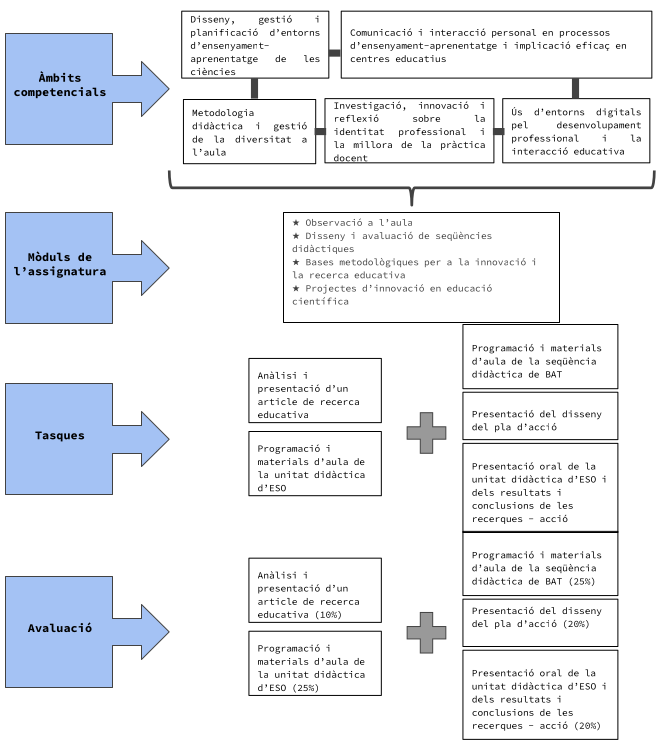

## Presentació

* Aquesta assignatura té la finalitat de complementar la formació disciplinària dels estudiants de l'àmbit de les ciències naturals. Partint de l'anàlisi dels currículums d'educació secundària, analitzarem com abordar l'ensenyament de les ciències des d'una perspectiva alhora integrada i disciplinària.

* L'objectiu principal d'aquesta assignatura és oferir una formació científica complementària que completi els coneixements del grau o nivell d'accés al màster.

 

## Informació tècnica

* **Codi de l'assignatura:** 31543

* **Temps:**
  - Jornada completa: segon semestre
  - Jornada parcial: primer any, anual

* **Nombre de crèdits:** 5

* **Dedicació:** 35 hores presencials i 90 hores de treball autònom (125 hores en total)

* **Professors:** Xavier Muñoz (coordinació), Iván Marchán, Laia Ramon-Sala, Gemma Viscasillas

 

{width=50% fig-align="center" group="cfd-inicio"}

 

## Mòduls d'assignatures

* **Reprèn l'anàlisi**

* **Biologia**

* **Geologia**

* **Física**

* **Química**

**Nota:** Cada estudiant ha de cursar dos dels quatre blocs disciplinaris proposats (Biologia, Geologia, Física i Química).

 

## Gols

* Conèixer els models científics clau de les disciplines científiques de l'especialitat que no corresponen a la titulació obtinguda.

* Comprendre els errors conceptuals més rellevants relacionats amb els models clau de la ciència.

* Conèixer i aplicar les estratègies docents més eficients perquè l'alumnat pugui fer front als errors conceptuals més rellevants relacionats amb els models clau de la ciència.

 

## Competències

1. Disseny, gestió i planificació d'entorns d'ensenyament-aprenentatge de les ciències

2. Comunicació i interacció personal en els processos d'ensenyament-aprenentatge i implicació efectiva en els equips docents

3. Metodologia docent i gestió de la diversitat a l'aula

4. Ús d'entorns digitals per al desenvolupament professional i la interacció educativa

 

## Continguts

### Contingut comú (per a tots els estudiants)

* Descripció i anàlisi dels plans d'estudis de ciències naturals d'ESO i batxillerat

* Anàlisi de la prova científicotecnològica de 4t d'ESO

### L'ensenyament de la biologia a l'educació secundària

* Els grans temes de la Biologia

* Quines són les principals preguntes que els alumnes de batxillerat haurien de poder respondre?

* Quins són els principals obstacles en l'aprenentatge de la Biologia?

* Quins poden ser bons contextos per presentar continguts de Biologia?

* Quins recursos tenim?

### L'ensenyament de la Geologia a l'educació secundària

* Els grans temes de la Geologia

* Quines són les principals preguntes que els alumnes de batxillerat haurien de poder respondre?

* Quins són els principals obstacles en l'aprenentatge de la Geologia?

* Quins poden ser bons contextos per presentar continguts de Geologia?

* Quins recursos tenim?

### L'ensenyament de la Física a l'educació secundària

* Els grans temes de la Física

* Quines són les principals preguntes que els alumnes de batxillerat haurien de poder respondre?

* Quins són els principals obstacles en l'aprenentatge de la Física?

* Quins poden ser bons contextos per presentar continguts de Física?

* Quins recursos tenim?

### L'ensenyament de la Química a l'educació secundària

* Els grans temes de la Química

* Quines són les principals preguntes que els alumnes de batxillerat haurien de poder respondre?

* Quins són els principals obstacles en l'aprenentatge de la Química?

* Quins poden ser bons contextos per presentar continguts de Química?

* Quins recursos tenim?

 

## Metodologia

* Les sessions seran teòrico-pràctiques, es combinaran activitats per treballar a l'aula amb exposicions del professorat. Predominaran, per tant, les metodologies d'aprenentatge actiu i es facilitarà la pràctica reflexiva.

* L'estudiant tindrà a la seva disposició els materials utilitzats a les classes a la plataforma virtual.

 

## Avaluació

### Tasca 1: Anàlisi dels currículums (25%)

* Aquesta és una activitat grupal. Aquesta activitat pretén analitzar el currículum de ciències de l'ESO, es realitzarà en grup i s'avaluarà mitjançant una exposició oral que realitzarà cadascun dels grups.

### Tasca 2: Avaluació dels coneixements disciplinaris (35%)

* El coneixement de cada disciplina s'avaluarà mitjançant la realització d'un examen col·laboratiu.

**Fase 1:** Cada estudiant ha de realitzar individualment una prova escrita. L'alumne ha de respondre per escrit les preguntes relacionades amb els dos blocs que ha cursat. Els professors recolliran el treball escrit.

**Fase 2:** Immediatament després de la fase 1, es formaran grups de 4-5 alumnes (segons instruccions del professorat). Cada grup compartirà i argumentarà les respostes individuals i tornarà a respondre les preguntes en un únic document que també recollirà el professorat.

**Fase 3:** Cada alumne tornarà a treballar individualment i farà una regulació metacognitiva.

### Tasca 3: Avaluació dels coneixements didàctics de disciplines científiques (30%)

* En grups formats per alumnes que cursen el mateix bloc.

* Cada grup ha de redactar una proposta d'activitat d'ensenyament-aprenentatge sobre el tema i el nivell indicats, coherent amb el currículum de secundària i que mobilitzi els continguts i recursos treballats en el bloc disciplinari corresponent. També caldrà indicar els criteris que s'utilitzarien per avaluar els alumnes.

### Competència digital (10%)

 

## Recursos i bibliografia recomanada

### Bibliografia bàsica

Sanmartí, N., 2002. L'ensenyament de les ciències a l'educació secundària obligatòria. Síntesi de l'educació.

Izquierdo, M., Aliberas, J., 2004. Pensar, actuar i escriure a la classe de ciències. Per un ensenyament racional i raonable de les ciències. Cerdanyola: Publicacions UAB.

Currículum de ciències naturals per a Educació Secundària Obligatòria i Batxillerat. http://xtec.gencat.cat/ca/curriculum/eso/curriculum/ i http://xtec.gencat.cat/ca/curriculum/batxillerat/curriculum/

### Bibliografia addicional

Alfaro, P. Biologia i geologia: Complements de formació disciplinària (2011). Ed. Graó.

Aymerich, M. I., Díaz, M. J. M., Rodríguez, E. P., Julián, M. S. G., Matarredona, J. S., Pérez, D. G., & Aguado, A. M. W. (2011). Física i Química. Complements formatius disciplinaris (Vol. 51). Grao.

Atkins, P., Jones, L. (1997). Química: Molècules, Matèria, Canvi, Ediciones Omega, S.A., (3a Edició) Barcelona (traducció Claudi Mans). ISBN 84-282-1131-0

Bueno, A. D. P., Mellado, V., Anta, A., Belmonte, M., Casellas, O., Corominas, J., ... & Oro, J. (2011). Física i química. Recerca, innovació i bones pràctiques (Vol. 3). Ministeri d'Educació.

Caamaño, A. Física i Química. Complements formatius disciplinaris (2011). Ed. Graó.

del Carmen Martín, L. M., Aleixandre, M. P. J., de Pro Bueno, A., Barros, S. G., Rodríguez, E. P., Losada, C. M., ... & Vilallonga, R. M. P. (2011). Didàctica de la Biologia i la Geologia (Vol. 22). Grao.

Feynman, Richard Phillips; Leighton, Robert B.; Sands, Mateu (2000). Física, tres volums. Ed. ALHAMBRA MEXICANA, S.A.

de Pro Bueno, A. (2011). Biologia i Geologia. Recerca, innovació i bones pràctiques (Vol. 23). Grao

Harlen, W. (2010). Principis i grans idees de l'educació científica. Ed. Rosa Devés (www.innovec.org.mx)

Harlen, W. (2011). Treballant cap a grans idees d'educació científica. Educació en Ciència.

Jones, A., McKim, A. Reiss, M. 2010. L'ètica a l'aula de ciència i tecnologia. Nou enfocament de l'ensenyament i l'aprenentatge.

Manzanal, R. F., Pérez, D. G., de Heredia, A. H. P., Rodríguez, E. P., Iglesia, P. M., Peña, A. V., ... & Mocholí, C. S. (2011). Biologia i Geologia. Complements formatius disciplinaris (Vol. 21). Graó.

Murray, J. (2000) Ensenyament de la química secundària ISBN 0 7195 7638 5

Sanmartí, N., Cañal, P., Aleixandre, M. P. J., Couso, D., Pintó, R., Ametller, J., ... & De Pro, A. (2011). Didàctica de la Física i la Química (Vol. 2). Ministeri d'Educació.

Sanmartí, N., Del Carmen, L., Bueno, A. D. P., Barros, S. G., Aleixandre, M. P. J., Márquez, C., ... & Losada, C. M. (2011). Didàctica de la Biologia i la Geologia (Vol. 2). Ministeri d'Educació.

Strahler, Arthur N (1987). Geologia física. Barcelona: Omega.

Solomon, E.P., Berg, L.R., Martin D.W. 2008. Biologia. McGraw-Hill/Interamericana.

Taber, K. (2002), Conceptes equivocats químics: prevenció, diagnòstic i cura; Part 1 - Fonaments teòrics. Londres: Royal Society of Chemistry ISBN 13: 9780854043866

Tarbuck, Edward J, Lutgens, Frederick K (2005). Ciències de la Terra: una introducció a la geologia física (8a ed). Madrid: Prentice Hall.

Tipler, Paul Allen; Vola, Gene. (2010) Física per a la ciència i la tecnologia Ed. Revertir 6ed. 2 volums

V.V.A.A. (2010). Ciències de la Terra i de l'Univers. The Student Encyclopedia, T 10. Santillana/EL PAÍS.

V.V.A.A. (1984). Història Natural dels Països Catalans. Volums I, II i III. Enciclopèdia Catalana. Barcelona

Com funcionen les coses. La física de la vida quotidiana. Louis A. Bloomfield. Wiley & Sons, Inc. 2010A Framework for K-12 Science Education. Consell Nacional d'Investigació de les Acadèmies Nacionals. The National Academic Press, Washington, 2012
