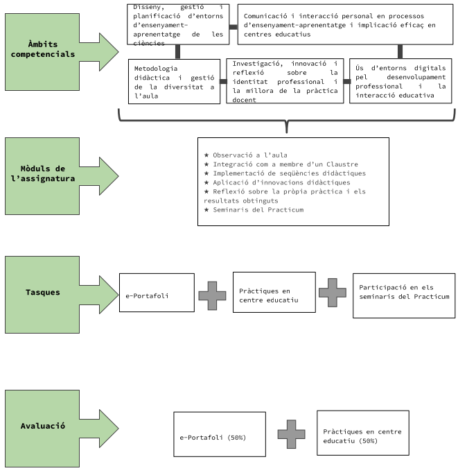

## Presentació

* La finalitat principal del pràcticum del Màster de Formació del Professorat d'Educació Secundària és l'adquisició de competències relacionades amb l'exercici professional, a més de ser un espai per posar en pràctica i sintetitzar en acció els coneixements adquirits en la resta d'assignatures. La pràctica ha d'implicar experiència professional en construcció.

* El pràcticum està dedicat a l'observació i participació en un centre de secundària i a la reflexió sobre la seva realitat i sobre l'acció educativa de l'alumne. Aquest és el primer contacte amb la professió, i és el moment de reconèixer models d'actuació, contrastar les reflexions teòriques amb la pràctica real, així com fer preguntes sobre les pròpies idees i competències.

* Hem de ser conscients que assistim a la realitat de l'activitat d'ensenyament i aprenentatge, no una mostra del que seria ideal, de perfecció; que els mentors i la resta de professionals que trobareu als centres són "persones" amb els seus problemes personals, familiars i laborals.

* És important aprofitar l'oportunitat que se'ns ofereix per conèixer i reflexionar sobre aspectes que s'han de millorar als centres educatius. Sereu els futurs professionals, que aviat us trobareu exercint en un centre com el que ara us acull com a observadors; Ets, doncs, el primer interessat a aprofitar tots els coneixements que adquiriràs en aquest curs per redactar avaluacions i reflexions que ens ajudin a fer i aplicar propostes de millora al sistema educatiu.

 

## Informació tècnica

* **Codi de l'assignatura:** 32018

* **Temps:**
  - Jornada completa: primer i segon semestre
  - Jornada parcial: segon any, anual

* **Nombre de crèdits:** 14

* **Dedicació:** 250 hores de treball al centre de pràctiques, 20 hores de seminaris pràctics i 185 hores de treball autònom (455 hores en total)

* **Professor responsable:** Marcel Costa (coordinació), mentors dels centres de pràctiques i tutors de la universitat

 

{width=50% fig-align="center" group="practicas-inicio"}

 

## Mòduls d'assignatures

* **Observació a l'aula**

* **Integració com a membre d'un Senat**

* **Implementació de seqüències didàctiques**

* **Aplicació d'innovacions didàctiques**

* **Reflexió sobre la pròpia pràctica i els resultats obtinguts**

* **Seminaris de pràctiques**

 

## Gols

* Conèixer el funcionament i l'organització dels centres de secundària.

* Seguir i analitzar el dia a dia d'un professor de ciències de secundària.

* Participar activament en les diferents activitats que es duen a terme en un centre educatiu.

* Integrar-se a la Facultat, equips docents i departament de ciències d'un centre educatiu.

* Ajudar al mentor en tasques específiques de gestió i correcció de les activitats docents.

* Consensuar amb el mentor els temes de la seqüència didàctica i unitat a dissenyar a l'assignatura DEIA.

* Implementar la seqüència dissenyada i la unitat didàctica, observar-ne els resultats i proposar millores.

* Contrastar amb el mentor els resultats de les activitats docents realitzades i aplicar els suggeriments de millora rebuts.

* Realitzar intervencions educatives vinculades al TFM.

* Recopilar dades i observacions derivades de la recerca-acció realitzada en el context del TFM.

 

## Competències

### 1. Coneixement i participació en el centre educatiu

* Coneixement de la realitat social i cultural del centre

* Cercar informació sobre el projecte educatiu i el funcionament del centre

* Participació activa en la vida del centre com a membre de la Facultat

* Comunicació i relació adequada amb tots els membres de la comunitat educativa

### 2. Rendiment dins l'aula

* Emmarcar les accions didàctiques en funció del context de cada grup i del funcionament del centre educatiu

* Interacció constructiva amb l'alumnat per afavorir la participació de tots

* Actitud temperada i respectuosa a l'aula per facilitar la resolució positiva de conflictes

* Tenir un bon coneixement dels alumnes i mantenir un clima d'aula adequat

* Capacitat comunicativa a nivell verbal i no verbal amb els alumnes

* Ús de recursos didàctics adequats per a cada activitat docent

### 3. Disseny i implementació de situacions d'aprenentatge

* Coneixement dels continguts i estructuració adequada de les activitats d'aprenentatge (contextualitzades i basades en competències)

* Planificar processos d'avaluació formativa i formativa.

* Crear documents, materials i recursos de treball per als alumnes de manera creativa, adequada i coherent.

* Utilitzar metodologies d'aula adequades al context de l'alumnat i a la intenció didàctica.

* Competència digital docent suficient en relació a la intervenció realitzada a l'aula

* Gestionar adequadament el temps tant en el disseny com en la realització de les activitats docents.

* Considerar els valors democràtics i universals pactats a nivell social (sostenibilitat, compromís i justícia social, equitat, etc.)

* Reflexioneu sobre el desenvolupament de les sessions a l'aula i el feedback rebut del vostre mentor, especialment pel que fa a l'aprenentatge dels estudiants, per construir coneixements pràctics que permetin millores en el futur.

 

## Pla de treball

El pràcticum es distribuirà en dos períodes i s'estructurarà en tres fases:

* **Fase d'observació** (25 hores de dedicació)

* **Fase d'intervenció acompanyada** (75 hores de dedicació)

* **Fase d'intervenció autònoma** (150 hores de dedicació)

La primera fase i part de la segona es realitzaran durant el primer període de pràctiques. La part final de la segona fase i la totalitat de la tercera es realitzaran durant el segon període de pràctiques.

### Reunions amb el mentor

* A l'inici de cadascuna de les fases, l'alumnat es reunirà amb el seu mentor i el coordinador de pràctiques del Centre per planificar les tasques que realitzaran durant aquesta etapa. La planificació ha d'incloure totes les tasques requerides en el pla de treball de pràctiques.

### Fase d'observació

* Aquest període té la finalitat de fer una anàlisi global del centre, el seu model de pràctica educativa i de gestió i la seva relació amb l'entorn, així com establir un primer contacte amb la vida del centre i l'aula.

**Tasques específiques que s'han de realitzar durant aquesta fase:**

* Assistir a les classes del mentor.

* Assistir a les reunions de coordinació del Departament.

* Assistir a reunions de coordinació de professors de diferents àrees del mateix nivell.

* Consulteu al mentor sobre quins temes es poden desenvolupar les situacions d'aprenentatge.

### Després de la fase d'observació

* Després de la fase d'observació, s'ha de començar a dissenyar una seqüència didàctica d'almenys 4-5 sessions per a batxillerat (2-3 si es treballa individualment) i una unitat didàctica completa per a l'ESO, d'un mínim de 8 sessions (6 sessions si es treballa de manera individual), que s'impartiran durant la fase d'intervenció autònoma.

### Fase d'intervenció acompanyada

* En aquest període, l'estudiant comença realitzant intervencions puntuals a l'aula amb el suport i supervisió del mentor i el seguiment i reflexió del tutor del màster. A més de les tasques específiques assignades, l'alumne ha de participar activament a les classes del mentor i, si és possible, a d'altres del centre. Durant els primers dies d'aquesta segona fase (encara al primer trimestre del curs), l'estudiant acordarà amb el seu mentor el tema concret de les unitats de programació, que dissenyarà i aplicarà posteriorment (fase d'intervenció autònoma). També durant aquesta fase hauràs de conèixer i familiaritzar-te amb els grups d'alumnes en què realitzaràs les teves classes durant la fase d'intervenció autònoma.

**Tasques específiques que s'han de fer durant aquesta fase:**

* Proposar i impartir un mínim de dues activitats a les classes del mentor i valorar-ne el desenvolupament. L'estudiant ha de seleccionar un mínim de dues activitats d'entre tots els recursos que s'han facilitat en el mòdul d'especialització docent i adaptar-les a les classes del mentor. Si és possible, es recomana que les dues activitats siguin diverses, com ara pràctiques experimentals, activitats TAC, activitats de debat, jocs de rol, entre d'altres.

* Participar en una sortida fora de l'aula si coincideix amb el calendari de pràctiques.

* Corregiu alguns dels exercicis que han fet els alumnes: Consensuar amb el mentor els criteris de correcció. Fes una anàlisi dels resultats obtinguts. Realitzar un retorn formatiu als alumnes.

* Assistir a les reunions d'avaluació (si és possible)

* Assistir a les reunions de coordinació del Departament

* Assistir a reunions de coordinació de professors de diferents àrees del mateix nivell.

* Participar en algunes sessions de tutoria amb tot el grup classe.

* Assistir a una reunió de coordinació del tutor

* Assistir a algunes reunions amb les famílies. (si és possible)

* Assistir a algunes reunions de tutoria individualitzada amb els alumnes.

* Acordar amb el tutor, abans de finalitzar el primer període d'estada al centre, els continguts a impartir en la tercera fase del pràcticum, és a dir, els temes específics de la seqüència didàctica de batxillerat i la unitat didàctica d'ESO.

### Fase d'intervenció autònoma

* L'objectiu principal d'aquesta fase és portar a l'aula les seqüències didàctiques que s'han dissenyat d'acord amb el seu mentor i el tutor universitari, amb tot el que comporta: seguiment, avaluació i actuant com a professor responsable del grup classe, prenent les decisions corresponents per gestionar l'aula.

* A més de la implantació d'aquestes seqüències didàctiques, al llarg d'aquesta fase, l'alumne continuarà participant i col·laborant en el mateix tipus d'activitats que va desenvolupar al llarg de la fase d'intervenció acompanyada (assistència a reunions, assistència a activitats fora del centre, ajuda al mentor en les tasques de correcció, etc.). Així mateix, realitzarà aquelles actuacions que li permetin obtenir dades del cicle d'investigació-acció vinculades a l'elaboració del treball de fi de màster (TFM).

 

## La Cartera

### Característiques

* El portfoli és una col·lecció d'informació i documentació representativa d'un procés d'aprenentatge. Es tracta d'un instrument formatiu que inclou l'anàlisi i la reflexió sobre les actuacions que s'han dut a terme i el disseny de plans de millora, elements bàsics que permeten l'autoaprenentatge i la formació continuada en el futur professional.

* Al mateix temps, també és un instrument d'acreditació, ja que permet a la persona que està aprenent mostrar el que ha après i com ho ha après d'una manera molt personal i completa, documentant-ho amb material representatiu.

* Durant les pràctiques, l'estudiant ha d'elaborar un portafoli que, com a objectiu principal, ha de mostrar el desenvolupament de les competències bàsiques del professional docent, que posarà en pràctica durant la seva estada al centre docent. El portfoli és un bon instrument per facilitar i demostrar el desenvolupament d'aquestes competències, tant en el període de formació inicial en què et trobes, com en la teva futura pràctica i promoció professional.

* El format de presentació del portfoli serà electrònic i es farà amb un lloc de Google.

* En aquest enllaç podeu copiar l'estructura preestablerta d'una plantilla. Es penjarà un document a l'aula virtual amb tots els detalls del procediment d'inici de la cartera i les seves funcionalitats.

### Elaboració

* La cartera es realitzarà durant els dos períodes d'estada al centre de pràctiques, amb lliuraments en horaris diferents, que es correspondran amb les tasques que es realitzaran en cada fase del pràcticum segons el pla de treball específic en cada cas. Heu d'haver completat tota la cartera al final de la fase d'intervenció autònoma.

### Estructura

El portfoli recollirà diferents tasques que es realitzen amb el suport de diferents matèries:

| Tasques | Tema on treballes |
|--------|------------------------------|
| 1. El meu centre de pràctiques | Practicum (seminaris) |
| 2. La història del Practicum | Practicum (seminaris) |
| 3. La revista d'investigació Practicum | DEIA |
| 4. Les dues situacions d'aprenentatge | DEIA |
| 5. Enregistrament en vídeo de la intervenció de l'alumne a l'aula, autoavaluat i coavaluat per un company | Practicum (seminaris) |
| 6. Valoració personal de com s'han desenvolupat les competències bàsiques d'ensenyament durant el pràcticum | Practicum (seminaris) |

### 1. El meu centre de pràctiques

* Durant la fase d'observació s'ha d'incloure al portfoli una breu descripció del centre on es realitza el Pràcticum. Es posarà èmfasi en la visió personal de l'estudiant de màster, responent a les preguntes següents: Quina imatge vas treure al centre de pràctiques durant la fase d'observació? En què s'assembla al centre on vas estudiar i en què és diferent?

### 2. La història del Pràcticum

* Durant la fase d'observació del Pràcticum es farà una breu història sobre un fet rellevant que s'ha viscut al centre de pràctiques, amb l'objectiu de familiaritzar-se amb l'ús dels registres narratius per a la pràctica reflexiva. Això s'analitzarà en un dels seminaris del Pràcticum i s'incorporarà al portfoli, després d'haver-lo treballat a classe.

### 3. Diari de consulta

* El diari de consulta es realitzarà durant tot el període de pràctiques i té l'objectiu de desenvolupar la capacitat reflexiva dels futurs docents com a eina per entendre millor els processos d'ensenyament i aprenentatge, i saber utilitzar aquests coneixements per millorar les seves pràctiques docents i innovar. Es realitzarà en format electrònic, mitjançant una plantilla disponible al portafoli electrònic. A les sessions del DEIA es treballaran les diferents fases del diari.

### 4. Les dues situacions d'aprenentatge

* Durant la fase d'intervenció autònoma, s'han d'adjuntar al portafoli les dues situacions d'aprenentatge dissenyades i implementades a l'aula durant aquesta fase de pràctiques.

### 5. Gravació en vídeo de la intervenció a l'aula

* Durant la fase d'intervenció del pràcticum caldrà gravar algunes sessions de classe, les que semblin més representatives. Al final d'aquesta fase, s'han de seleccionar alguns fragments de les gravacions, ja siguin moments bons o problemàtics, que siguin representatius de la comunicació i la interacció constructiva a l'aula i del model didàctic i les opcions metodològiques. No es tracta només de mostrar els moments perfectes, sinó també aquells que ens agradaria comentar. S'aconsella seleccionar entre 3 i 5 moments d'uns 3-4 minuts i fer una edició d'un màxim de 15 minuts.

* Els vídeos es treballaran a l'últim seminari del Pràcticum i s'han d'adjuntar al portafoli juntament amb una autoavaluació i una coavaluació.

### 6. Valoració personal del desenvolupament de les competències docents

* Durant el primer seminari del pràcticum es farà una taula per explicar l'avaluació personal inicial de les competències docents. En el darrer seminari, a partir de les experiències viscudes en la segona fase de pràctiques, es contrastarà entre aquesta avaluació inicial i la visió final del grau de desenvolupament personal de les competències docents. Aquest contrast es guiarà per la rúbrica d'avaluació del pràcticum i tindrà una extensió màxima de dues pàgines. Aquest escrit ha de constar:

**Què s'ha après i com s'ha après.** Fa referència als aspectes concrets de cada competència que s'han après durant aquest període i a la/s activitat/es que han facilitat aquest aprenentatge.

**Els punts forts** o aspectes que més s'han aconseguit en cada competició.

**Els punts febles** o aspectes a millorar en el futur de cada competició.

**Els intents de millora realitzats.** Es refereix a les millores realitzades durant els mesos de pràctica.

**Evidència** per documentar les afirmacions fetes en l'informe d'avaluació de competències. És bo relacionar, sobretot, els punts forts i les millores referides amb material representatiu que els confirmi. Aquest material pot ser material que ja s'hagi adjuntat prèviament al portafoli (recursos utilitzats, situacions d'aprenentatge, gravació de vídeo) o qualsevol altra evidència que consideri oportuna.

 

## Avaluació, seguiment i retroalimentació

* L'avaluació del pràcticum es farà des dels centres on els estudiants realitzen els dos períodes de pràctiques i pels tutors universitaris. Durant les dues fases del pràcticum, el mentor i l'alumnat signaran setmanalment una taula on es mostren les tasques realitzades i les hores d'assistència al centre.

### Portafoli electrònic (50%)

* Serà avaluat pel tutor de la UPF i es tindrà en compte globalment la regularitat de les aportacions realitzades, així com la qualitat de les reflexions en els diferents apartats (vegeu detalls a l'apartat específic de l'e-Portfolio). Si en algun moment el portfoli no conté tots els materials necessaris per demostrar l'assoliment de les competències docents, el tutor de pràctiques ho comunicarà a l'estudiant perquè ho corregeixi.

* La presentació del portfoli serà requisit indispensable per poder superar el pràcticum i proposar el Treball Final de Màster (TFM).

* Cada estudiant comptarà amb un tutor de la universitat, que s'encarregarà del seguiment de la pràctica i donarà suport en l'elaboració del portfoli. Durant tot el període de pràctiques es farà un seguiment continuat del tutor a través del portafoli electrònic. A més, hi haurà una sèrie de sessions programades al llarg del curs, anomenades Seminaris de Pràcticum on es tractaran tots els aspectes relacionats amb el Pràcticum i les tasques que s'han d'incorporar a l'e-portafoli.

### Pràctiques en un centre educatiu (50%)

* Seran avaluats pel mentor de la pràctica i es basaran en el desenvolupament de les competències docents, descrites a la rúbrica d'avaluació de la pràctica.

* El tutor universitari visitarà l'estudiant per observar com realitza una o més sessions de classe durant la segona pràctica. Aquesta visita pretén proporcionar retroalimentació a l'estudiant però no té cap pes en la nota global de la pràctica.
