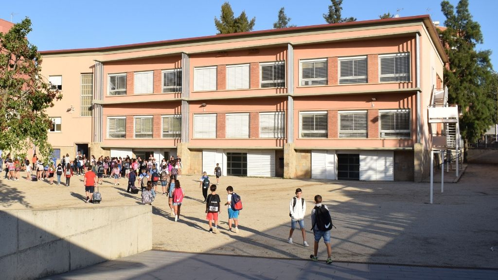

# La meva imatge del centre i l'activitat didàctica del meu mentor

El meu centre de pràctiques, l'escola concertada "Los Gabrielistas", està situat al poble de Viladecans. El meu mentor de pràctiques es diu Carlos Giménez Esteban i és llicenciat en biologia amb 35 anys d'experiència docent, tots ells en aquesta mateixa escola.

L'activitat educativa del Carlos se centra en els 4 anys d'ESO i els dos batxillerats. A partir de 4t d'ESO només imparteix classes de cultura científica i a batxillerat s'encarrega de les assignatures relacionades amb la biologia, les matemàtiques de 2n des de batxillerat, i els reptes científics actuals de la biologia-geologia. Els dos últims dies de la primera setmana i els 2 primers de la segona setmana de pràctiques van coincidir amb els exàmens del primer trimestre i el dimecres següent després dels exàmens va ser l'excursió de classe de batxillerat. Això ha fet que, durant aquells dies, les classes estiguessin centrades en el repàs i la preparació dels exàmens, fet que va fer que la dinàmica fos molt diferent de l'habitual.

::: {style="display: flex; gap: 0.5em; align-items: stretch; justify-content: space-between;"}
::: {style="flex: 50%;"}

:::

::: {style="flex: 50%;"}

:::
:::

## Panoràmica de l'Escola Sant Gabriel de Viladecans

L'**Escola Sant Gabriel de Viladecans** és un centre educatiu concertat situat a Viladecans. És una institució dirigida per la congregació religiosa dels Germans de Sant Gabriel, que forma part de la comunitat educativa gabrielista amb més de 100 anys d'història educativa. El cert és que no difereix gaire de l'escola on vaig anar, que també era una escola concertada catòlica, llevat del salt generacional dels alumnes. A part d'aquest aspecte temporal evident, he de dir que la diferència és quasi nul·la. Així doncs, la imatge que em porto de l'escola és la mateixa que tenia de l'escola on vaig anar, el cert és que aquestes pràctiques m'han portat molts records dels meus temps escolars.

En ser una escola concertada d'ESO, però no de batxillerat, la barrera econòmica crea una barrera social que possiblement és un dels motius de la quasi inexistent conflictivitat a les aules. Un altre aspecte és la ubicació de l'escola en una zona d'habitatge de nova construcció o habitatge de preu mitjà-alt. Aquests dos aspectes marquen el perfil de les famílies que vénen a estudiar a l'escola. Aquesta afirmació no vol dir que una situació econòmica còmoda o sense problemes *per se* no pugui generar conflicte, però en la meva experiència personal en aquesta pràctica no ha estat així. El que està clar és que l'escola té una història molt forta a Viladecans ja que amb els seus 100 anys d'història educativa a la vila, l'escola és un centre educatiu de gran tradició i considerat prestigi entre la població viladecanina. Al voltant de l'escola, cada tarda hi ha molta activitat esportiva extraescolar i tinc la impressió que és com si fos un lloc de trobada social en aquella zona cèntrica de Viladecans.

### Identitat i Projecte Educatiu

Els gabrielistes constitueixen una comunitat educativa que té com a objectiu principal preparar els estudiants per al seu futur, animant-los a integrar de manera lliure i responsable les actituds i els valors cristians a les seves vides. L'escola promou la formació integral de l'alumnat segons una concepció cristiana de la persona, preparant-lo per participar activament en la millora i transformació de la societat. És una escola oberta a tothom sense cap tipus de discriminació, inserida en la realitat sociocultural de Catalunya amb un compromís de servei, que treballa des d'una escola integral que atén la diversitat de capacitats, interessos i ritmes d'aprenentatge.

### Oferta Educativa

El centre ofereix un itinerari educatiu complet des dels 3 anys fins als estudis postobligatoris:

**Educació Infantil** (3 a 6 anys): Sis unitats amb una capacitat de 25 alumnes per aula.

**Educació Primària** (6 a 12 anys): Dotze unitats organitzades en grups A i B per curs, amb una capacitat de 25 alumnes per aula.

**Educació Secundària Obligatòria - ESO** (12 a 16 anys): Vuit unitats distribuïdes en cursos de 1r a 4t, amb una capacitat de 25 alumnes per aula.

**Baxillerat** (a partir de 16 anys): Modalitats Cientificotecnològiques i Humanitats-Ciències Socials, amb dues unitats i capacitat de 35 alumnes per aula.

**Formació Professional** (de 16 a 18 anys): Els Cicles Formatius són estudis específics destinats a dotar de competències professionals i preparar l'estudiant per a l'inserció en el món laboral o superior. L'escola ofereix:

-   **Grau Mitjà**: Guia en el medi natural i temps lliure, i Electromecànica de vehicles de motor en modalitat DUAL FP.
-   **Grau Superior**: Docència i animació socioesportiva, i Automoció en modalitat DUAL FP.

### Projectes Educatius

L'escola desenvolupa diversos projectes transversals:

**Aula Gabrielista**: Estructuració del conjunt de tècniques d'aprenentatge i treball a l'aula.

**Projecte Multilingüe**: Preparació dels alumnes per interactuar en un entorn social i cultural divers.

**Pla lector**: promou la competència lectora i l'adquisició del gust per la lectura.

**Sostenibilitat**: Acció per al desenvolupament d'una ecologia integral, sent reconeguda com a Escola Verda.

**Programa de Salut**: Recursos i valors per a la promoció integral de la salut, connectats permanentment amb la Fundació Hospital de Nens de Barcelona.

**Cohesió Social**: Foment d'un clima afectuós i familiar des d'una visió inclusiva.

### Activitats i serveis extraescolars

L'escola ofereix un ampli programa d'activitats extraescolars que inclou: Programació i Robòtica, Teatre, MiniMúsics, Anglès, Guitarra, i diverses activitats esportives com Taekwondo, Pàdel, Natació, Patinatge i Dansa. Durant l'estiu, organitza colònies poliesportives i específiques de ball i pàdel per a nens de 3 a 13 anys. El centre disposa d'un servei de menjador escolar amb menús saludables, i ofereix serveis addicionals com l'Oxford Test of English per certificar el nivell d'anglès, un departament d'orientació, i la venda de llibres i uniformes a través d'una botiga online. Actualment l'escola celebra el seu centenari (1925-2025) destacant la seva llarga trajectòria educativa al servei de la comunitat de Viladecans.

