# El meu relat de pràctiques

La veritat és que he estat pensant unes quantes vegades en la història del pràcticum perquè no hi ha hagut res d'extraordinari ni d'extraordinari ja que als grups on he estat: 4t d'ESO i 2 de batxillerat no hi ha cap conflicte, una clara diversitat racial o cognitiva o qualsevol altra cosa a destacar o ampliar per construir aquest relat.

Vull recordar que el primer dia no estava nerviós, sinó *molt expectant* i els primers dies vaig ser extremadament prudent amb tot el que vaig fer i dir. El cert és que, en aquesta fase d'observació, llevat que en Carlos em convides a aportar més informació al que explicava, m'he limitat a estar al fons de la classe observant i prenent notes. Les meves intervencions han estat per afegir comentaris o explicacions extres que el Carlos donava a classe, però recordo que el tercer dia de la primera setmana ja estava participant en les explicacions del Carlos. Aquestes intervencions han anat creixent amb el temps a mesura que anava guanyant més confiança en mi mateix i la confiança entre Carlos i jo.

En tot cas, m'agradaria ampliar un parell d'aspectes que m'han cridat l'atenció i que han estat una constant en els 3 grups i sobretot en les assignatures optatives. La primera circumstància que em va cridar l'atenció va ser que els **alumnes s'agrupen a classe per sexe**, ja sigui per treballar en grup durant les classes optatives o simplement per seure i seguir les explicacions de les classes no optatives. No hi va haver dia que aquesta situació no es tornés a repetir. Això es facilita pel fet que *Carlos no crea els grups*, sinó que els mateixos alumnes s'agrupen i això fa que els grups sempre acabin sent els mateixos, cadascun amb els seus amics i separats per sexe. Aquest aspecte del sexe, no sé si està relacionat amb el fet que l'escola sigui religiosa o no, ja que no tinc criteris per comparar amb les escoles públiques laiques.

Al meu parer, aquesta situació *empobreix l'intercanvi d'idees diferents*, i no ajuda a una bona i forta cohesió de tots els components de l'aula i que en definitiva *incideix en l'entorn de l'aula i la seva gestió*. Invertir aquesta dinàmica podria ajudar a crear una major cohesió de l'alumnat com a grup i, evidentment, el treball en grup es veuria molt enriquit per la diversitat d'idees. Normalment els amics tenen idees molt semblants i treballar amb amics està bé, però crec que en aquestes etapes és empobreix fer sempre treballs en grup amb amics i separats per sexe.

L'altre fet que em va cridar l'atenció i que no em va agradar gens és l'**ús de l'ordinador portàtil quan no és estrictament necessari**. Només he descrit aquesta circumstància a l'institut i he pogut comprovar que molts alumnes es distreuen fent altres coses com jugar, dissenyar la postal de Nadal del concurs escolar mentre en Carlos o un altre alumne presenta el seu treball a l'escenari.

He comentat ambdós aspectes amb Carlos, el meu tutor, i òbviament és conscient d'ambdues circumstàncies. El que més em sorprèn és que en Carlos no lluita contra aquestes situacions per revertir-les, donada la seva àmplia experiència amb més de 35 anys com a professor sempre a la mateixa escola i que també és un excel·lent professor, amb un control aclaparador del currículum i una gestió immillorable de la funció docent. El meu conflicte intern, o el que vull dir en aquesta història, és per això que amb la seva experiència no fa res sabent que el treball en grup es podria millorar si els grups fossin dissenyats per ell mateix i, d'altra banda, no permetre l'ús d'ordinadors portàtils quan no és estrictament necessari.

::::: {style="display: flex; gap: 2em; align-items: stretch; justify-content: space-between;"}
::: {style="flex: 50%;"}
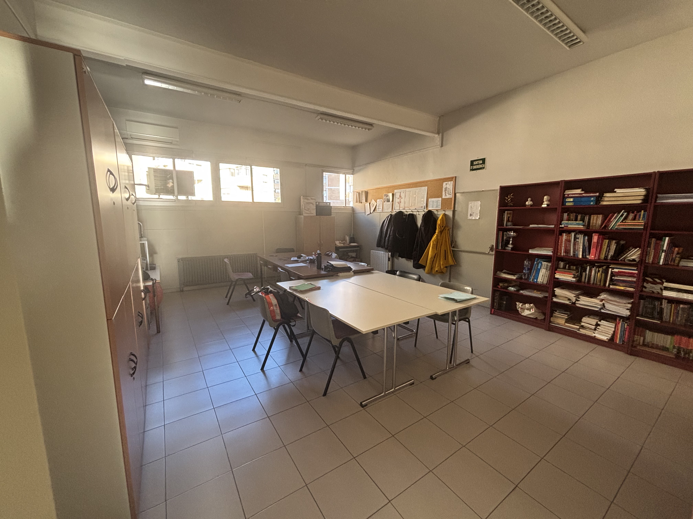
:::

::: {style="flex: 50%;"}
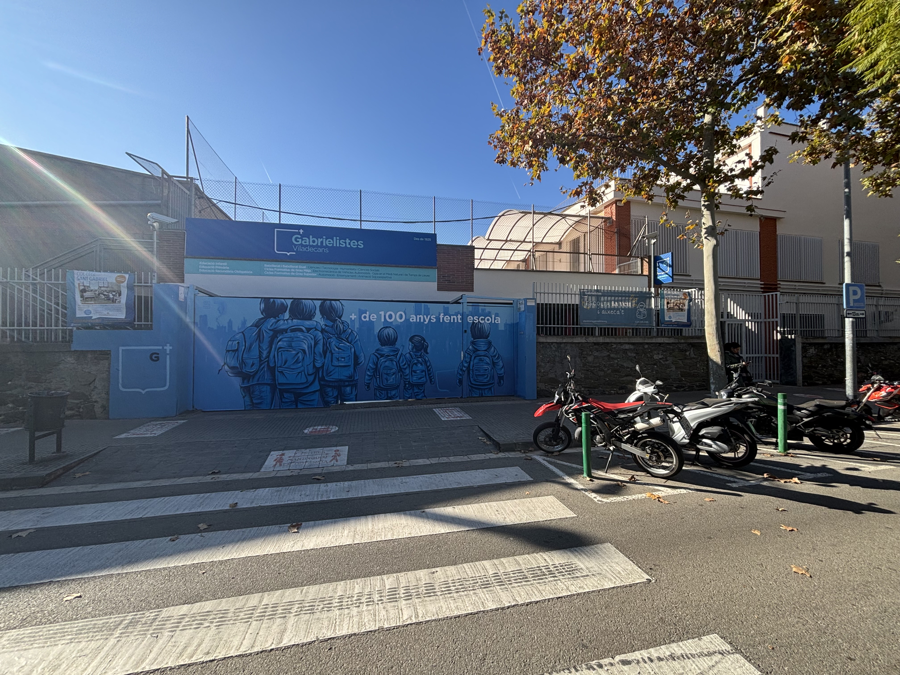
:::
:::::

Possiblement, en aquest punt amb els seus 35 anys d'experiència, té clar que hi ha batalles que mereixen ser lliurades (i n'he vist algunes a classe) i que altres batalles no ho són, com les circumstàncies que he descrit. És un tema del qual no he volgut parlar a fons amb el Carlos per no incomodar-lo ni fer-li pensar que podria posar en dubte la seva tasca docent, que em sembla excel·lent, però m'hauria agradat haver tractat aquest tema molt més a fons amb ell per saber per què no fa res per revertir aquestes dues situacions.

El que sí que li vaig dir quan parlàvem de les situacions d'aprenentatge que hauré de preparar per a la segona fase de la pràctica és que *dissenyarem jo mateix els grups de treball* per crear grups heterogenis barrejant alumnes per sexe i amb l'ajuda de Carlos també inclouré el paràmetre de rendiment acadèmic per equilibrar cognitivament els grups. També li vaig dir que a les meves classes *demanaré als alumnes que mantinguin els ordinadors portàtils fora de la taula quan no sigui estrictament necessari* per evitar confusions. En tots dos casos, em va dir que, sense cap problema, podré gestionar les meves classes com cregui. Veurem quins resultats donen els grups heterogenis i si realment es millora la cohesió del grup i el rendiment del treball grupal. I espero que la limitació de l'ús dels ordinadors portàtils no sigui un motiu de fricció amb l'alumnat intentant explicar-los-ho d'una manera coherent i beneficiosa per a ells.

La cirereta del pastís al final de les tres setmanes va ser que els alumnes de 2n de batxillerat es van acomiadar molt cordialment i em van preguntar per què marxava tan aviat. He de reconèixer que em va sorprendre quan em van preguntar per què marxava tan aviat, ja que no m'ho esperava i la veritat és que em va agradar molt.

# El meu diari d'investigació a la pràctica - Part 1

Per començar o obrir el meu diari d'investigació, cal començar enllaçant-lo amb el meu relat de la fase d'observació del pràcticum per definir el problema a investigar. Dins d'aquestes aules tranquil·les, com he comentat al meu relat, el que més m'ha cridat l'atenció durant aquesta fase d'observació ha estat la **imiscibilitat entre sexes** i l'**ús de l'ordinador portàtil quan no és estrictament necessari**. D'aquests dos punts, la immiscibilitat entre sexes seria la meva àrea d'interès que vull treballar i centrar-me durant la fase d'intervenció. Em sembla molt important perquè, al meu entendre, si es pogués revertir aquest comportament de l'alumnat, els efectes de millora tindrien repercussions en l'entorn de l'aula, la cohesió del grup, l'intercanvi d'idees noves i diferents entre ells i, en definitiva, un major rendiment acadèmic i millora cognitiva en exposar els alumnes a idees noves i diferents més enllà dels seus amics. Aquests resultats o possibles efectes de millora em semblen molt importants i per aquest motiu vull implementar mesures correctores per veure si es pot millorar el rendiment acadèmic del treball grupal dels alumnes, hi ha una major cohesió grupal independentment del gènere i en definitiva una millora acadèmica en general. Dir que l'ús de l'ordinador portàtil serà un tema menor que crec que parlar i arribar a un acord amb ells perquè no ho facin quan no sigui estrictament necessari serà més que suficient.

Per tant, un cop identificat el problema que es produeix tant a 4t d'ESO com als dos grups de batxillerat a través de les meves tres setmanes d'observació, ara les preguntes més concretes que m'agradaria investigar serien com i de quina manera revertir la situació sense ser massa pertorbador. I d'altra banda, el plantejament de la meva hipòtesi és que l'agrupació per sexe per al treball en grup serà molt beneficiosa per als estudiants en diversos aspectes, des del rendiment cognitiu, humà i acadèmic.

Crec que la solució a aquesta situació té una primera opció clara, que seria crear grups multinivell, creant grups heterogenis a partir de la variable que vull treballar, que és el sexe de l'alumne, i una segona variable de treball per equilibrar aquests grups heterogenis seria el rendiment cognitiu individual de cada alumne. En aquesta segona variable necessitaré l'ajuda d'en Carlos (ja que coneix bé els alumnes) per equilibrar cognitivament els grups. D'aquesta manera, es pretén millorar el procés d'ensenyament i aprenentatge de l'alumnat amb la millora de la pràctica docent mitjançant la implantació de grups heterogenis multinivell.

# Autoavaluació de les meves habilitats docents

::: panel-tabset
## Autoavaluació de les competències docents {.active}

<embed src="/files/autoavaluacio-competencies-docents.pdf" type="application/pdf" width="100%" height="800px"/>

:::

# Altres notes personals durant la fase d'observació més enllà de la història

## Les meves intervencions com a observador

El cert és que en aquesta fase d'observació, llevat que el Carlos em convides a aportar més informació al que explicava, m'he limitat a estar al fons de la classe observant i prenent notes. Les meves intervencions han estat per afegir comentaris o explicacions extres que el Carlos donava a classe, però recordo que el tercer dia de la primera setmana ja estava participant en les explicacions del Carlos. Aquestes intervencions han anat creixent amb el temps a mesura que anava guanyant més confiança en mi mateix i la confiança entre Carlos i jo. També he ajudat a supervisar exàmens durant aquests 4 dies de trimestral i he interactuat molt amb els professors de batxillerat ja que l'activitat del Carlos a les classes d'ESO es limitava a l'assignatura de cultura científica de 4t d'ESO.

El cert és que aquest fet és l'únic punt 'no òptim' que puc posar a les pràctiques ja que limita la meva experiència d'interacció amb la resta del professorat a unes 5 persones amb les quals he tingut contacte directe dins de la sala de professors de batxillerat. L'única interacció amb el professorat d'ESO va ser quan vaig anar al claustre conjunt de professorat d'ESO i batxillerat, però es va parlar sobretot dels problemes de certs alumnes de formació professional bàsica.

## Les meves impressions generals d'aquestes 3 setmanes

::::: {style="display: flex; gap: 2em; align-items: stretch; justify-content: space-between;"}
::: {style="flex: 70%;"}
Una cosa que em va agradar molt va ser que en Carlos em va preguntar com estava anant al final del segon dia, i després em va tornar a preguntar al final de la primera setmana. Em va agradar la sensació que li importava com em sentia els meus primers dies. A més, he de dir que hi ha hagut una molt bona química entre el meu mentor i jo, amb inquietuds vitals molt semblants i això ajuda molt. En relació als alumnes, haig de dir que la complexitat és quasi inexistent o diria zero. La diversitat racial és molt limitada o anecdòtica amb un romanès i una noia de Moldàvia de 2n de batxillerat i una xinesa de 4t d'ESO. En els 3 casos, la integració tant a nivell lingüístic com en la relació amb la resta d'alumnes és total, i tots 3 són bons alumnes. Per tant, aquesta complexitat gairebé nul·la, sense problemes d'integració i absència d'alumnes amb algun problema cognitiu o conductual ha portat a classes tranquil·les i sense res a destacar. En general, els alumnes estan parant atenció, prenent apunts, i sense res a denunciar excepte 4 o 5 vegades que en Carlos ha hagut de cridar l'atenció, sempre de manera anònima i sense necessitat de repetir la crida d'atenció. Només una vegada en Carlos ha repetit la trucada d'avís amb l'amenaça de fer-la fora de classe. Totes aquestes crides d'atenció s'han centrat en el batxillerat, més encara en el 2n de batxillerat, mentre que el grup de 4t d'ESO es podria definir com a exemplar.

També vull destacar que la meva relació i interacció amb la resta de professors de batxillerat ha estat molt bona i sempre hi ha hagut moments per parlar a la sala de professors de diversos temes, tant escolars com extraescolars, o conversa lleugera durant la mitja hora de prendre un cafè al bar de l'altre costat del carrer, on vam anar tots junts. Com he comentat anteriorment, l'únic *però* va ser la circumstància que en Carlos (i jo amb ell) només ens vam moure per la sala de professors de batxillerat i això va limitar la meva interacció amb la resta de professors d'ESO més enllà de les dues reunions que vam tenir tots junts.

Finalment, m'agradaria destacar la meva assistència a la reunió del professorat de batxillerat i ESO que va tenir lloc durant la meva primera setmana de pràctiques. En aquesta reunió es van tractar diversos temes de batxillerat i ESO però de manera rutinària, però el debat principal va girar al voltant de la problemàtica de certs alumnes de formació professional bàsica que tenien dificultats per seguir les normes de l'escola i la seva actitud desafiant en alguns casos. La disparitat en les maneres d'abordar aquests problemes era molt evident i hi havia certa tensió al professorat. També la meva presència a la reunió d'avaluació de batxillerat després dels exàmens del primer trimestre ha estat força formativa ja que la manera d'analitzar determinades situacions de diversos alumnes amb notes baixes per part de diversos professors ha estat variada segons el professor.
:::

::: {style="flex: 40%;"}

:::
:::::

## Situacions d'aprenentatge acordades per a la fase d'intervenció

Finalment, en Carlos i jo ja hem acordat quines accions didàctiques duré a terme durant la fase d'intervenció que durarà 7 setmanes des de mitjans de febrer fins a mitjans d'abril de 2026. Aquestes seran les següents:

| 4t ESO | 2n Batxillerat |
|------------------------------------|------------------------------------|
| Per a [4 d'ESO]{style="font-weight: bold;"}, faré el punt [La Terra a l'Univers](#) inclòs a l'assignatura Biologia i Geologia. Descripció de l'origen de l'univers i la seva relació amb els astres que conformen el sistema solar. Anàlisi i comparació d'hipòtesis sobre l'origen de la vida, arguments. Discussió de les principals investigacions en l'àmbit de l'astrobiologia. | Per a [2n de batxillerat]{style="font-weight: bold;"}, la situació d'aprenentatge és la [assignatura optativa trimestral sobre objectius de desenvolupament sostenible](#). L'ODS que es tractarà serà l'objectiu de desenvolupament sostenible número 13 "Acció pel clima" que s'inclou en el bloc temàtic de medi ambient sostenible. En aquesta acció concreta, en Carlos m'ha demanat que utilitzi una pel·lícula o un documental en aquesta docència i per parelles per fer una breu presentació de les cites de l'ODS 13, centrant l'atenció en les implicacions del canvi climàtic i la sostenibilitat. |

A part d'aquestes situacions d'aprenentatge, faré una classe d'anglès a petició de la professora d'anglès (Montse) sobre el canvi climàtic i les implicacions geopolítiques i econòmiques de la reducció del casquet glacial del Pol Nord. D'altra banda, m'han demanat fer una intervenció d'un dia en un cicle formatiu d'interpretació del paisatge amb una excursió a la serra del Garraf per explicar el perquè de la fisiografia del paisatge des del punt de vista de la geologia.

També he organitzat unir-me a Carlos en diverses activitats. La primera serà la visita que faré amb els alumnes de 1r de Batxillerat a la Facultat de Biologia de la Universitat de Barcelona el 16 de gener de 2026, que servirà de preludi d'una situació d'aprenentatge de la biologia que es desenvoluparà durant la meva segona pràctica. Més tard, el 26 de gener, em va convidar a assistir a l'exposició de treballs de recerca a l'escola. Finalment, també aniré amb Carlos el 17 de febrer a les sessions d'orientació al Fòrum de Viladecans, que és com una exposició del treball de recerca que duu a terme l'ajuntament de Viladecans, on cada centre educatiu de la ciutat porta els 2 millors treballs de recerca dels alumnes de batxillerat.

# Notes manuscrites del període de pràctiques d'observació

::: {layout-ncol="1"}
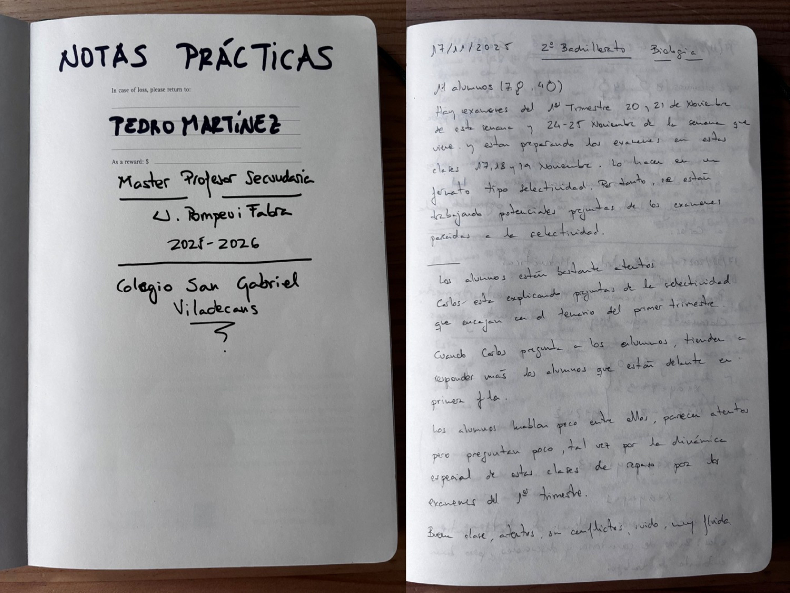{fig-align="center" group="portfolio-inicio"}

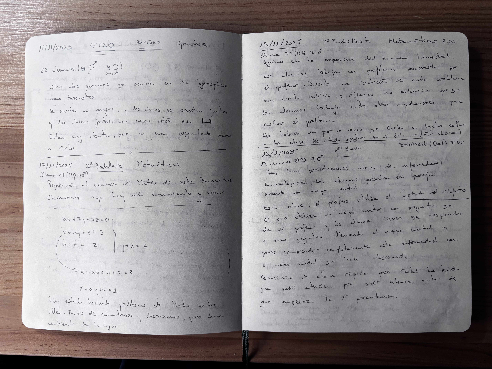{fig-align="center" group="portfolio-inicio"}

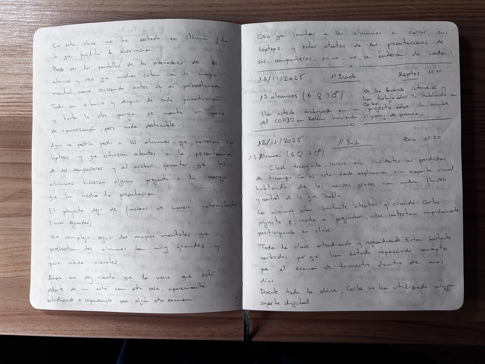{fig-align="center" group="portfolio-inicio"}

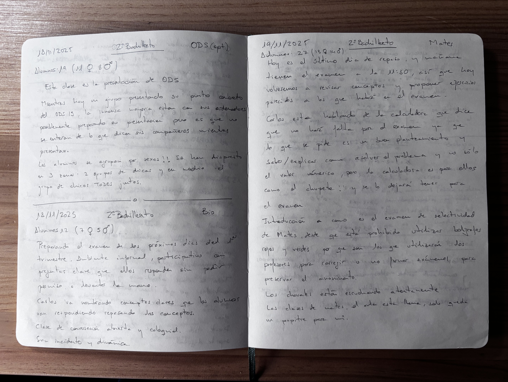{fig-align="center" group="portfolio-inicio"}

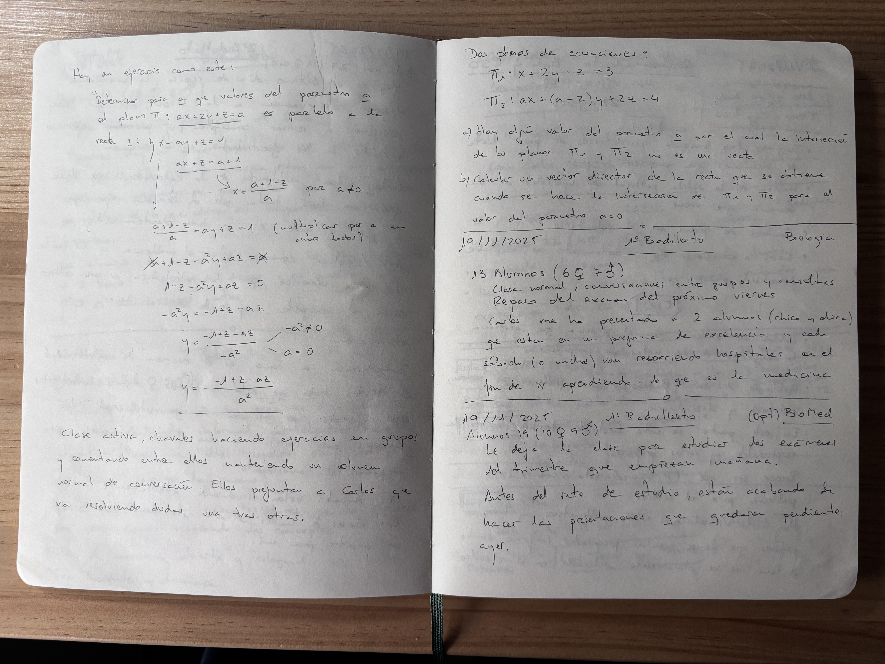{fig-align="center" group="portfolio-inicio"}

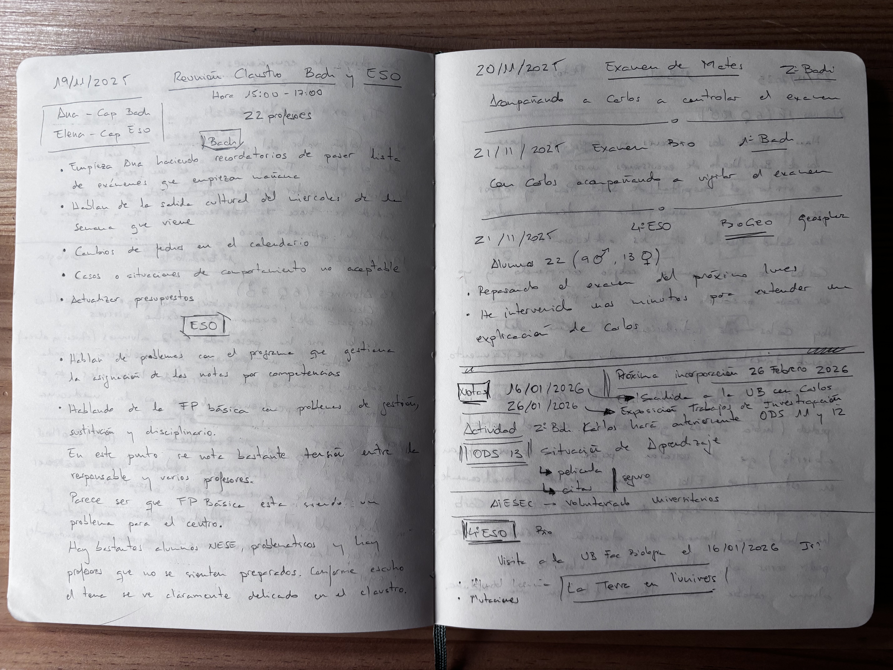{fig-align="center" group="portfolio-inicio"}

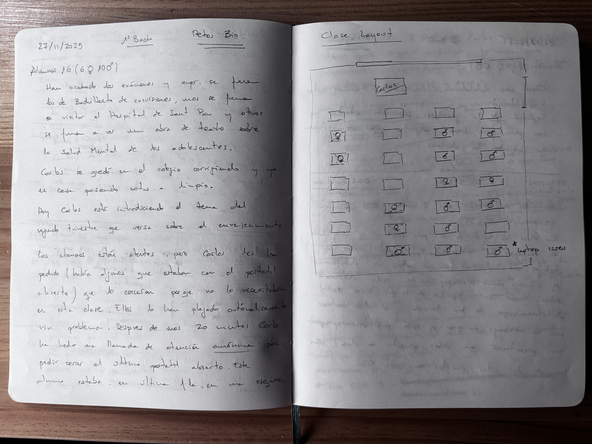{fig-align="center" group="portfolio-inicio"}

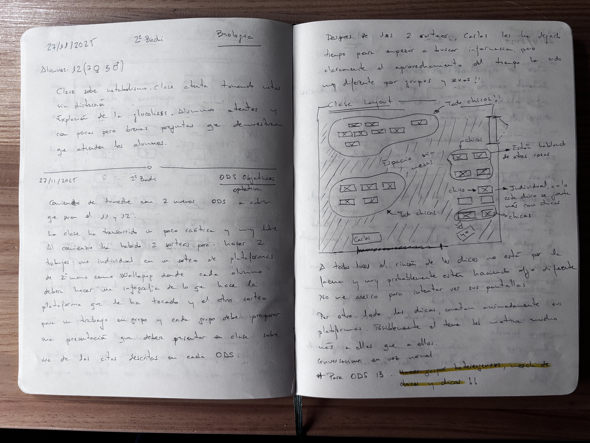{fig-align="center" group="portfolio-inicio"}

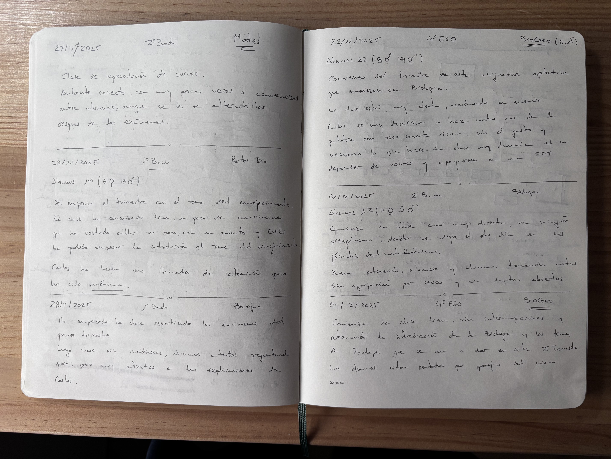{fig-align="center" group="portfolio-inicio"}

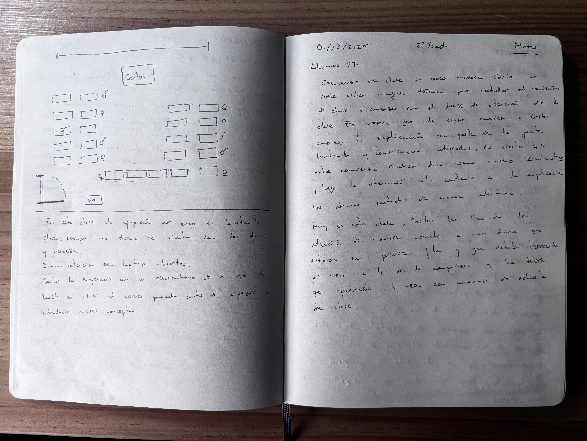{fig-align="center" group="portfolio-inicio"}

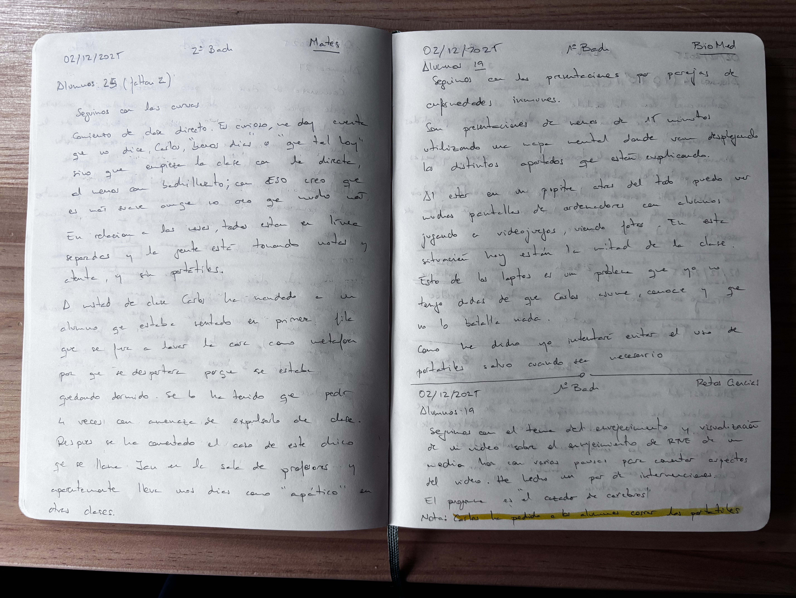{fig-align="center" group="portfolio-inicio"}

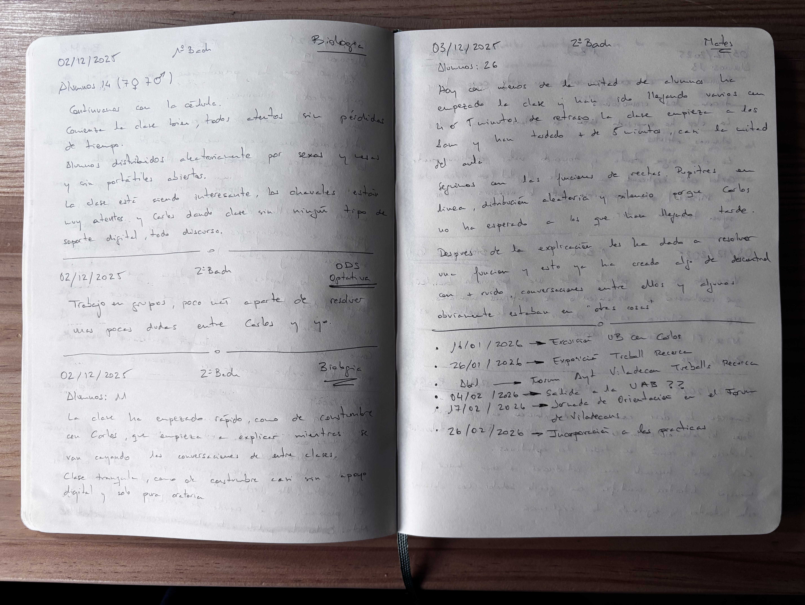{fig-align="center" group="portfolio-inicio"}

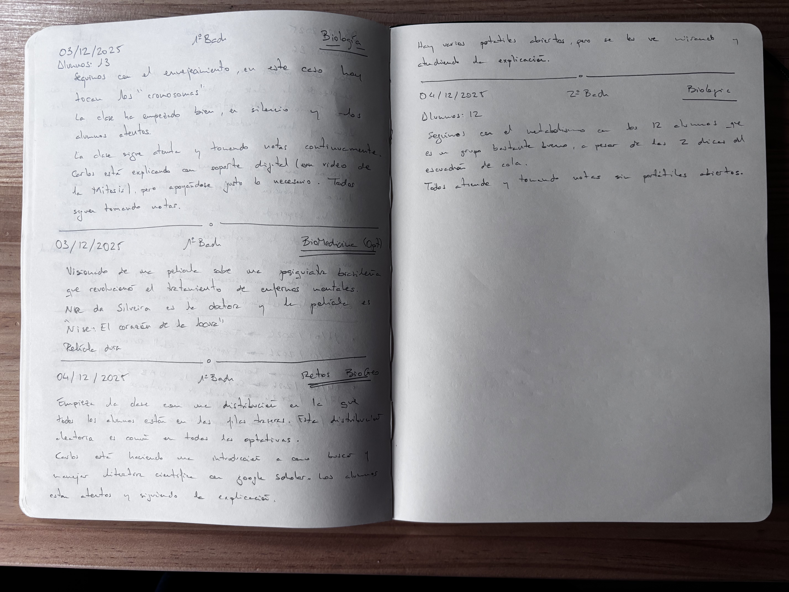{fig-align="center" group="portfolio-inicio"}
:::