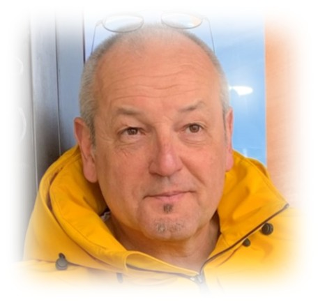
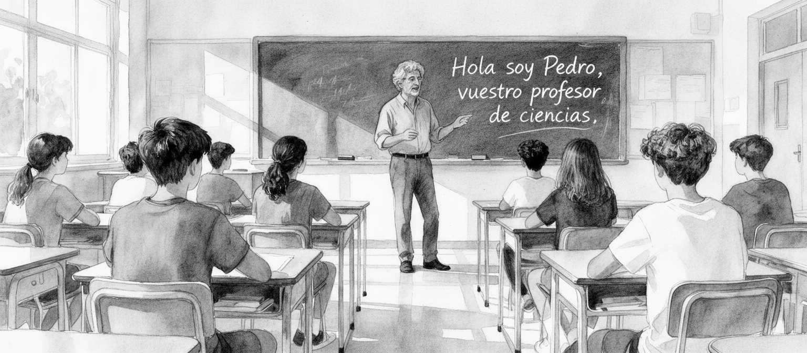

::: {.light-content layout="[31,69]" layout-valign="center"}
{fig-align="center" group="about-this-me" loading="lazy"}

{fig-align="center" group="about-this-me" loading="lazy"}
:::

::: {.dark-content layout="[31,69]" layout-valign="center"}
{fig-align="center" group="about-this-me" loading="lazy"}

{fig-align="center" group="about-this-me" loading="lazy"}
:::

## Professional Profile

[Download CV](/files/CV-Pedro-Martinez.pdf){.highlight width="10%"}

Hello, I am **Pedro Martínez Durán** - **Senior Petroleum Geologist and passionate FullStack WebGIS Developer** with more than 25 years of international experience in geosciences, exploration, geospatial analysis and management.

I obtained a BSc in Geology from the University of Zaragoza (Spain) in 1993, studying the last two years at the University of Burgundy (France) and the University of Aberdeen. I later obtained an M.Phil. in carbonate sedimentology and sequence stratigraphy at the University of Zaragoza, publishing several articles.

For some years, I developed my career as a mining exploration geologist (working in Chile, Argentina, Bolivia, USA, Türkiye, Portugal, France and Italy). ESIC's MBA and Master in Marketing and Sales led me to various management positions for almost 8 years as CEO in three positions. Finally, this degree in management was completed with the PDG from IESE in 2007. In 2010 I returned to geology, becoming a petroleum geologist after completing the M.Sc. in Petroleum Geosciences at Royal Holloway in 2011.

I was based in the UK for 14 years as a petroleum exploration geologist and seismic interpreter working at CGG. My role focused on studies related to Reservoir Geology, Carbon Capture and H2 Storage, involving seismic interpretation of 3D and 2D regional studies at a regional scale, carrying out the complete structural analysis, seismic interpretation of the pre- and syn-rift packages and salt basins in North and West Africa, North Sea, Gulf of Mexico, New Zealand, Australia, as well as in the evaluation of several blocks in Asia, and complex unitization processes of oil fields in Algeria and Tunisia.

In recent years, I have completed internal and external training in geographic information techniques, especially with Remote Sensing datasets using ArcGIS Pro and Google Earth Engine programming in JavaScript along with training in SQL and Python to address complex geographic data sets and carry out any type of analytical approaches.

This extensive international experience has provided personal and work skills in any environment, such as critical thinking, problem solving, collaborative skills, strong emotional intelligence, cognitive flexibility and decision making focused on customer service and negotiation skills.

### Experience and Specializations

> **Petroleum Geosciences and Exploration** - Senior petroleum geologist and seismic interpreter with extensive experience in basin analysis, structural geology and tectono-stratigraphy on multiple continents.

> **Carbon Capture and Storage (CCUS) and Hydrogen Exploration** - Specialized in Carbon Capture, Utilization and Storage projects, including geological site selection and reservoir evaluation for sustainable energy solutions.

> **Geographic Information Systems (GIS)** - GIS and remote sensing analyst with advanced skills in ArcGIS Pro, QGIS and Google Earth Engine for complex geographic data sets and spatial analysis.

> **WebGIS Development** - Passionate FullStack WebGIS Developer with experience in creating interactive and easy-to-use web mapping applications using modern web technologies with the following technology stack:
>
> - **Frontend**: JavaScript (React), TypeScript (Vaadin Hilla), Python
> - **Backend**: Java (Spring Boot), Python
> - **Databases**: SQL/NoSQL (DynamoDB)
> - **APIs**: RESTful services
> - **Cloud**: AWS Services
> - **Relevant projects:**
>     - [Dashboard to track event participants](https://dashboardfest2fun-production.up.railway.app/){.external target='_blank'} - Event tracking dashboard
>     - [FullStack Real-Time Flight Tracking Application](https://pedrogeogiscoding.github.io/Flight_Tracker_PedroGeoGISdev/){.external target='_blank'} - Real-time flight tracking system
>     - [FullStack Renting Car Application with full CRUD functionalities and car tracking map](https://rentingcar-production.up.railway.app/){.external target='_blank'} - Complete car rental management system

> **International Project Management** - Demonstrated track record managing multidisciplinary geological projects in North and West Africa, North Sea, Gulf of Mexico, New Zealand, Australia and Asia.

### Main titles, courses and training

- **Full Stack Developer** (2024-2025) - Professional Certificate Level C (Barcelona, ​​Spain)
- **MSc. Geographical Information Science** (2021-2023) - University of Lund (Sweden)
- **MSc. Petroleum Geoscience** (2011) - Royal Holloway, University of London (Full scholarship, Distinction)
- **General Management Program** (2007) - IESE Business School
- **MBA** (2001) - European Business School of Aragon
- **M.Phil. Carbonate Sedimentology & Sequential Stratigraphy** (1997) - University of Zaragoza
- **BSc. Geology** (1993) - University of Zaragoza, with the 4th and 5th years at University of Burgundy (France) and University of Aberdeen (UK)

### At the moment...

Currently, studying the master's degree in secondary teaching at Pompeu Fabra University and actively looking for a new opportunity to work as **WebGIS Developer** focusing on:
- FullStack WebGIS development, Web Mapping, scalable architectures and backend development
- Geospatial analysis
- Cartography (Leaflet, Mapbox, OpenLayers)

### 📊 GitHub Stats

  
  

### Publications

:::{.column-}

| Date | Author | Title | Journal or Publisher |
None
| 2022 | **Pedro Martinez Duran** and Jarrad Grahame | New insights in the offshore fold-and-thrust belt in Timor Trough | AAPG Workshop Structural Styles and Hydrocarbon Prospectivity in Thrust Belt Settings: A Global Perspective. Barcelona |
| 2020 | Jarrad Grahame and **Pedro Martinez Duran** | New broadband imaging reveals prospective insights | GEO ExPro Magazine, Vol. 17, No. 3 |
| 2019 | **Martinez Duran, P.**, Baillie, P., Carrillo, E. & Duval, G. | Geological Development of the Timor Orogen | Geological Society, London, Special Publications, 490 |
| 2019 | Baillie, P., Keep, Myra., **Martinez Duran, P.**, Carrillo, E. & Duval, G. | Broadband seismic imaging around the Banda Arc: changes in the anatomy of offshore fold-and-thrust belts | Geological Society, London, Special Publications, 490 |
| 2019 | Baillie, P., Carter, Paul. & **Martinez Duran, P.** | Evolution and Plays of the Banda Arc | AAPG. Search and Discovery Article #11245 |
| 2018 | **Martinez Duran, P.**, Parsons, M., & Duval, G. | Revealing the Complexities of the Gabon Southern Margin through Gravity, Magnetics and Seismic Data Integration | AAPG International Conference and Exhibition. Cape Town, South Africa |
| 2018 | **Martinez Duran, P.**, Parsons, M., Soyer, W., & Duval, G. | Evidence for a more complex crustal setting offshore Gabon: support from a high-resolution regional seismic dataset integrated with 3D grav/mag modeling | 80th EAGE Annual Conference, Copenhagen |
| 2017 | **Martinez Duran, P.**, Baillie, P., Carrillo, E., & Duval, G. | Geological development of the offshore Timor Orogen | Petroleum Group of the Geological Society of London, Burlington House, London |
| 2017 | Baillie, P., **Martinez Duran, P.**, Carrillo, E., & Duval, G. | Fold & Thrust Belts of the Banda Arc | Petroleum Group of the Geological Society of London, Burlington House, London |
| 2017 | Parsons, M., **Martinez Duran, P.**, Soyer, W., & Duval, G. | Understanding the tectonic history offshore Southern Gabon with high resolution seismic, gravity and magnetics | First Break, 35(September), 1–8 |
| 2017 | Edwards, R., Sanderson, M., King, M. Duval, G., and **Martinez Duran, P.** | Enhancing SAR seep interpretation with broadband seismic data: A case study from the Timor Trough | The APPEA Journal |
| 2015 | **Martinez-Duran, P.**, Duval, G. and Baillie, P. | New Broadband Seismic Unveils the Complexity of the Timor-Leste Offshore Subduction Zone | AAPG Melbourne, Australia |
| 2015 | **Martinez-Duran, P.**, Gater, R., Chesser, K., et al. | The Petroleum Potential of the Late Cretaceous-Palaeogene Sediments of the Reinga, Northland and Deepwater Taranaki Basins | AAPG Melbourne, Australia |
| 2015 | **Martinez-Duran, P.**, Gater, R., Chesser, K., et al. | Insights into the reservoir quality of the Cretaceous to Miocene sediments of the Reinga/Northland and deepwater Taranaki basins: An integrated approach | New Zealand Petroleum Conference, Auckland |
| 2013 | **Martinez Duran, P.** et al. | Implications of a new analytical program on the petroleum potential of the late Cretaceous-Palaeocene sediments of the Great South and Canterbury Basins | New Zealand Petroleum Conference, Auckland |
| 2012 | Pueyo, E.L., Calvin, P., Casas, A.M., et al. | A research plan for a large potential CO2 reservoir in the Southern Pyrenees | Geo-Themes, 13, pp.1970-1973 |
| 2000 | Regueiro, M., **Martinez Duran, P.**, Gonzalo, F. | Industrial Rocks and Minerals from Spain | Geomining Technological Institute of Spain |
| 2000 | **Martinez Duran, P.** | Industrial Minerals in the South Cone | European Geologist, no. 9. Journal of the European Federation of Geologists |
| 2000 | Gajardo, A., **Martinez Duran, P.**, Regueiro, M. | Industrial Minerals in South America: European future industrial minerals grain-stock? | 36th Forum on Geology of Industrial Minerals and 11th Extractive Industry Geology Conference. Bath (U.K) |
| 1997 | **Martinez Duran, P.**, Melendez, A., Floquet, M. | Spatial distribution of parasequences controlled by paleogeographical local features. Examples from the Central Iberian Range | 18th Regional Meeting of Sedimentology (I.A.S). Heidelberg, Germany |
| 1995 | **Martinez Duran, P.**, Melendez, A. | Identification of sequences boundaries in epicontinental carbonate platform. Examples from Late Cenomanian-Middle Turonian. Central Iberian Range, Spain | 16th Regional Meeting of Sedimentology. Aix-les-Bains, France |

:::

#### Contact by email

- **Email:** [professional](mailto:pedromartinezduran@gmail.com)

#### Linkedin profile
  
[linkedin.com/in/pedromartinezduran/](https://www.linkedin.com/in/pedromartinezduran/)
