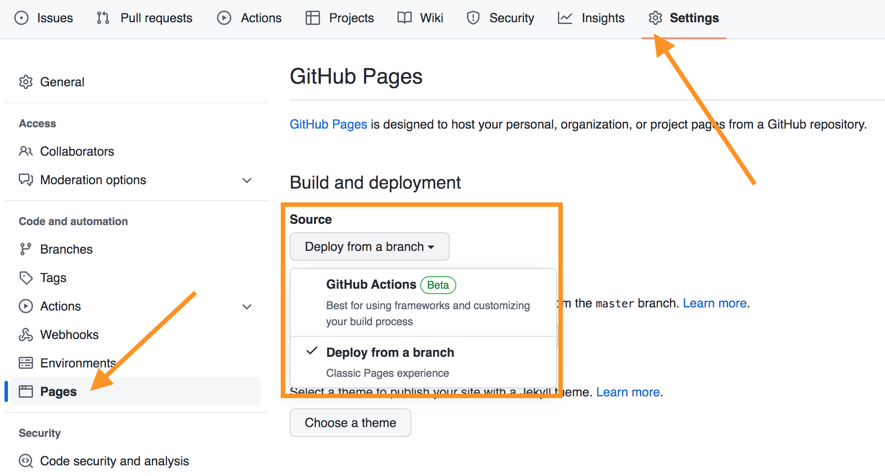

# Publish a Quarto Website to GitHub Pages with GitHub Actions

This guide provides a complete walkthrough to create and publish a Quarto website to GitHub Pages using GitHub Actions for automated deployment.

## Document Structure

This document is organized in **two main parts**:

### 📘 Part 1: Basic Quarto Tutorial (for beginners)

If you're creating your first Quarto website or need a site **in a single language**, this first part will guide you step by step:

- ✅ Create a Quarto website from scratch
- ✅ Configure Git and GitHub
- ✅ Implement GitHub Actions for automatic deployment
- ✅ Troubleshoot common issues

### 📗 Part 2: Multilingual Sites Manual (advanced)

If you already have experience with Quarto and need to create a **multilingual website** with language navigation, go directly to the [second part](#manual-building-and-publishing-a-multilingual-quarto-website) which covers:

- ✅ Multilingual project structure
- ✅ Language navigation system with JavaScript
- ✅ Solution to localhost vs GitHub Pages problem
- ✅ Workflow for multiple languages

---

## Prerequisites

Before you begin, make sure you have:

- **Git** installed on your computer ([Download Git](https://git-scm.com/downloads){target="_blank"})
- **Quarto** installed ([Download Quarto](https://quarto.org/docs/get-started/){target="_blank"})
- A **GitHub account** ([Sign up for GitHub](https://github.com/join){target="_blank"})
- A **text editor** or IDE (VS Code, RStudio, etc.)

## Create your Quarto Website

### Initialize a New Quarto Website

Open your terminal and run:

```bash
quarto create project website mywebsite
cd mywebsite
```

This creates a basic Quarto website structure with:

- `_quarto.yml` - Configuration file
- `index.qmd` - Home page
- `about.qmd` - About Page
- `styles.css` – Custom styles

### Configure your Website

Edit `_quarto.yml` to customize your site. Here is an example configuration:

```yaml
project:
  type: website
  output-dir: _site

website:
  title: "Mi Sitio Web"
  navbar:
    left:
      - href: index.qmd
        text: Inicio
      - about.qmd

format:
  html:
    theme: cosmo
    css: styles.css
    toc: true
```

**Key configuration options:**

- `output-dir`: Where rendered files are saved (default: `_site`)
- `title`: The title of your website
- `theme`: Choose from [Bootswatch themes](https://bootswatch.com/){target="_blank"}
- `navbar`: Navigation structure

### Preview your Website Locally

Test your website locally before publishing:

```bash
quarto preview
```

This opens a live preview on `http://localhost:4200` that updates automatically when you make changes.

## Set up the Git Repository

### Initialize the Git Repository

In your project directory:

```bash
git init
git add .
git commit -m "Commit inicial: Sitio web Quarto"
```

### Create `.gitignore`

Create a `.gitignore` file to exclude unnecessary files:

```gitignore
/.quarto/
/_site/
/.Rproj.user/
*.Rproj
.DS_Store
```

The `_site` directory will be generated by GitHub Actions, so we do not confirm it.

## Create the Repository on GitHub

### Create a New Repository on GitHub

1. Go to [GitHub](https://github.com){target="_blank"} and sign in
2. Click the **"+"** icon in the upper right corner
3. Select **"New repository"**
4. Enter the repository details:
   - **Repository name**: `mywebsite` (or your preferred name)
   - **Description**: Optional description
   - **Visibility**: Public (required for free GitHub Pages)
   - **DO NOT** initialize with README, .gitignore, or license
5. Click **"Create repository"**

{group="about-this-site" target="_blank"}

### Connect the Local Repository to GitHub

Copy the commands from GitHub (shown after creating the repository):

```bash
git remote add origin https://github.com/tunombredeusuario/mywebsite.git
git branch -M main
git push -u origin main
```

Replace `yourusername` with your actual GitHub username.

## Set up GitHub Pages

### Enable GitHub Pages

1. Go to your repository on GitHub
2. Click the **"Settings"** tab
3. Scroll down to **"Pages"** in the left sidebar
4. Under **"Source"**, select **"GitHub Actions"**

{ group="about-this-site" }

This tells GitHub to use GitHub Actions for deployment instead of a branch.

## Create the GitHub Actions Workflow

### Create the Workflow Directory

In the root of your project, create the GitHub Actions workflow directory:

```bash
mkdir -p .github/workflows
```

### Create the Workflow File

Create `.github/workflows/publish.yml` with the following content:

```yaml
name: Publish Quarto Website

on:
  push:
    branches: [main]
  workflow_dispatch:

permissions:
  contents: read
  pages: write
  id-token: write

concurrency:
  group: "pages"
  cancel-in-progress: false

jobs:
  build:
    runs-on: ubuntu-latest
    steps:
      - name: Checkout repository
        uses: actions/checkout@v4

      - name: Set up Quarto
        uses: quarto-dev/quarto-actions/setup@v2
        with:
          version: 'release'

      - name: Render Quarto Project
        run: quarto render

      - name: Upload artifact
        uses: actions/upload-pages-artifact@v3
        with:
          path: _site

  deploy:
    needs: build
    runs-on: ubuntu-latest
    environment:
      name: github-pages
      url: ${{ steps.deployment.outputs.page_url }}
    steps:
      - name: Deploy to GitHub Pages
        id: deployment
        uses: actions/deploy-pages@v4
```

### Understanding Workflow

**Workflow components:**

- **`on: push: branches: [main]`**: Activated with pushes to the main branch
- **`workflow_dispatch`**: Allow manual activation from the GitHub interface
- **`permissions`**: Permissions required for deployment to GitHub Pages
- **`concurrency`**: Prevents multiple deployments from running simultaneously
- **`build` job**: Download code, install Quarto, render site
- **`deploy` job**: Deploy the rendered site to GitHub Pages

**Key actions used:**

- [`actions/checkout@v4`](https://github.com/actions/checkout){target="_blank"}: Download your repository
- [`quarto-dev/quarto-actions/setup@v2`](https://github.com/quarto-dev/quarto-actions){target="_blank"}: Install Quarto
- [`actions/upload-pages-artifact@v3`](https://github.com/actions/upload-pages-artifact){target="_blank"}: Upload the site for deployment
- [`actions/deploy-pages@v4`](https://github.com/actions/deploy-pages){target="_blank"}: Deploy to GitHub Pages

## Deploy your Website

### Confirm and Upload the Workflow

Add and commit the workflow file:

```bash
git add .github/workflows/publish.yml
git add .gitignore
git commit -m "Añadir flujo de trabajo de GitHub Actions para despliegue"
git push
```

### Monitor Deployment

1. Go to your repository on GitHub
2. Click the **"Actions"** tab
3. You should see your workflow running

{group="about-this-site" target="_blank"}

4. Click the workflow run to view detailed logs
5. Wait for the **build** and **deploy** jobs to complete (usually 1-3 minutes)

### Access your Published Website

Once the deployment is successful, your website will be available at:

```
https://tunombredeusuario.github.io/mywebsite/
```

Replace `yourusername` with your GitHub username and `mywebsite` with the name of your repository.

## Custom Domain (Optional)

### Configure Custom Domain

If you have your own domain, you can use it instead of the default GitHub Pages URL:

1. Go to **Settings** → **Pages** in your repository
2. Under **"Custom domain"**, enter your domain (e.g. `www.mysite.com`)
3. Click **"Save"**

### Configure DNS Settings

Add DNS records with your domain provider:

**For apex domain (`mysite.com`):**

```
A     185.199.108.153
A     185.199.109.153
A     185.199.110.153
A     185.199.111.153
```

**For subdomain (`www.mysite.com`):**

```
CNAME     tunombredeusuario.github.io
```

More details: [GitHub Pages Custom Domain Documentation](https://docs.github.com/en/pages/configuring-a-custom-domain-for-your-github-pages-site){target="_blank"}

## Update your Website

### Make Changes Locally

Edit any `.qmd` file in your project:

```bash
# Editar archivos
nano index.qmd

# Previsualizar cambios
quarto preview
```

### Upload Changes

Commit and upload your changes:

```bash
git add .
git commit -m "Actualizar contenido"
git push
```

GitHub Actions will automatically rebuild and redeploy your website in minutes.

## Troubleshooting

### General Quarto and GitHub Pages Issues

This section covers common issues that can occur in both basic and multilingual sites.

#### Issue: Workflow fails with "Permission denied"

**Solution:** Make sure workflow permissions are set correctly:

1. Go to **Settings** → **Actions** → **General**
2. Under **"Workflow permissions"**, select **"Read and write permissions"**
3. Check **"Allow GitHub Actions to create and approve pull requests"**
4. Click **"Save"**

#### Problem: Error 404 when accessing the site

**Solution:** Verify that:

- The GitHub Pages feed is set to "GitHub Actions"
- Workflow completed successfully
- You are using the correct URL format
- The repository is public (for free GitHub Pages)

#### Problem: Styles or images do not load

**Fix:** This usually occurs with incorrect base paths. Update `_quarto.yml`:

```yaml
website:
  site-url: "https://tunombredeusuario.github.io/mywebsite"
  repo-url: "https://github.com/tunombredeusuario/mywebsite"
```

**For resources in multilingual sites:** Use relative paths from the current file:
```markdown

```
Absolute paths like `/images/about/pedro.jpg` don't work on GitHub Pages when the site is in a subdirectory (e.g., `username.github.io/repository/`)

#### Problem: Workflow does not activate

**Solution:**

- Make sure the workflow file is in the `.github/workflows/` directory
- Verify that the file has the `.yml` or `.yaml` extension
- Confirm that you pushed to the `main` branch
- Try activating it manually: **Actions** → **Workflow name** → **Run workflow**

#### Problem: Changes Don't Appear on GitHub Pages

**Solutions:**

1. **Clear browser cache**: Ctrl+F5 (Windows) or Cmd+Shift+R (Mac)
2. **Check deployment status**: 
   - Go to Actions on GitHub
   - Verify the GitHub Pages workflow completed successfully
3. **Wait a few minutes**: GitHub Pages can take 1-5 minutes to update

## Advanced Settings

### Use R or Python

If your Quarto documents use R or Python code:

#### Stall:

Update `.github/workflows/publish.yml` to include the R configuration:

```yaml
- name: Set up R
  uses: r-lib/actions/setup-r@v2

- name: Install R packages
  run: |
    install.packages(c("rmarkdown", "knitr", "tidyverse"))
  shell: Rscript {0}
```

#### For Python:

Update `.github/workflows/publish.yml` to include the Python configuration:

```yaml
- name: Set up Python
  uses: actions/setup-python@v5
  with:
    python-version: '3.11'

- name: Install Python packages
  run: |
    pip install jupyter matplotlib pandas numpy
```

### Freeze Computations

For complex computations, use Quarto's freeze function to avoid re-executing code on each deployment:

In `_quarto.yml`:

```yaml
execute:
  freeze: auto
```

This caches the computational results locally. Confirm the `_freeze/` directory:

```bash
git add _freeze/
git commit -m "Añadir computaciones congeladas"
```

## Useful Resources

### Official Documentation

- [Quarto Documentation](https://quarto.org/docs/guide/){target="_blank"}
- [Quarto Publishing Guide](https://quarto.org/docs/publishing/github-pages.html){target="_blank"}
- [GitHub Pages Documentation](https://docs.github.com/en/pages){target="_blank"}
- [GitHub Actions Documentation](https://docs.github.com/en/actions){target="_blank"}

### Quarto Resources

- [Quarto Gallery](https://quarto.org/docs/gallery/){target="_blank"} - Website Examples
- [Quarto Extensions](https://quarto.org/docs/extensions/){target="_blank"} - Add functionality
- [Quarto Community](https://github.com/quarto-dev/quarto-cli/discussions){target="_blank"} - Get Help

### GitHub Actions Resources

- [Quarto GitHub Actions](https://github.com/quarto-dev/quarto-actions){target="_blank"} - Official Actions
- [GitHub Actions Marketplace](https://github.com/marketplace?type=actions){target="_blank"} - Find Actions
- [Workflow Syntax](https://docs.github.com/en/actions/using-workflows/workflow-syntax-for-github-actions){target="_blank"} - Complete reference

## Summary

Now you have learned how to:

1. ✅ Create a Quarto website locally
2. ✅ Set up a Git repository
3. ✅ Create a repository on GitHub
4. ✅ Configure GitHub Pages
5. ✅ Configure GitHub Actions for automated deployment
6. ✅ Deploy and update your website
7. ✅ Fix common problems

Every time you push changes to your `main` branch, GitHub Actions will automatically rebuild and redeploy your website. This creates a seamless publishing workflow that requires no manual intervention.

Happy publishing! 🚀

---

# Advanced Manual

## Manual: Building and Publishing a Multilingual Quarto Website

This manual documents the complete process for creating, developing, and publishing a multilingual Quarto website that works perfectly in both local development and production on GitHub Pages.

### Multilingual Project Structure

The website is organized in three languages with the following folder structure:

```
wikiPedro_MasterUPF/
├── es/                 # Spanish (default root folder)
│   ├── _format.yml
│   ├── _quarto.yml
│   └── [.qmd files]
├── ca/                 # Catalan
│   ├── _format.yml
│   ├── _quarto.yml
│   └── [.qmd files]
├── en/                 # English
│   ├── _format.yml
│   ├── _quarto.yml
│   └── [.qmd files]
├── images/             # Shared resources
├── styles.css          # Global styles
└── _quarto.yml         # Global configuration
```

**Key principles:**
- Each language has its own folder with independent configuration
- Spanish (`es/`) renders to the site root (`/`)
- Shared resources (images, styles) are kept in common folders
- Each language folder has its own `_quarto.yml` and `_format.yml`

### Local Development

#### Previewing a Specific Language

To preview a language in local development:

```bash
# Spanish (from root)
quarto preview es

# Catalan
quarto preview ca

# English
quarto preview en
```

The local server will run at `http://localhost:3000/` (or similar port).

#### Rendering the Entire Site

Before publishing, render all language versions:

```bash
quarto render es && quarto render ca && quarto render en
```

This generates HTML files in the corresponding folders:
- `_site/` (Spanish)
- `_site/ca/` (Catalan)
- `_site/en/` (English)

### Language Navigation System

#### How the System Works

The site implements a language selector using JavaScript that allows switching between the three versions without losing the current page. The `switchLanguage()` function performs the following steps:

1. **Detects current path**: Gets the URL where the user is located
2. **Auto-detects environment**: Checks if the site is running on GitHub Pages or localhost
3. **Sets base path**: Uses `/wikiPedro_MasterUPF/` for GitHub Pages or `/` for localhost
4. **Cleans the path**: Removes the base path and existing language prefix (`ca/` or `en/`)
5. **Constructs new path**: Builds the URL with the target language prefix
6. **Navigates**: Redirects the browser to the new language version

#### Navigation Flow Example

When switching from English to Spanish:
- Current path: `/wikiPedro_MasterUPF/en/index.html` (on GitHub Pages)
- Remove base path: `en/index.html`
- Remove language prefix: `index.html`
- Construct Spanish path: `/wikiPedro_MasterUPF/index.html` (Spanish is in root)
- Navigate to new URL

#### The GitHub Pages vs Localhost Issue

**Problem**: Language navigation worked perfectly on GitHub Pages but failed when testing locally with `quarto preview`.

**Root Cause**: URL structure mismatch between environments:

- **GitHub Pages URL structure**:
  ```
  https://pedrogeogiscoding.github.io/wikiPedro_MasterUPF/
  ```
  The site is hosted in a subdirectory `/wikiPedro_MasterUPF/`

- **Localhost URL structure**:
  ```
  http://localhost:3000/
  ```
  The site is served from the root directory `/`

The original implementation had a hardcoded base path:
```javascript
const basePath = '/wikiPedro_MasterUPF/';
```

This worked on GitHub Pages where the path includes `/wikiPedro_MasterUPF/`, but on localhost, the function tried to find pages at paths like `/wikiPedro_MasterUPF/en/index.html` which don't exist locally (they're actually at `/en/index.html`).

#### The Solution: Environment Auto-Detection

The implemented solution automatically detects whether the site is running on GitHub Pages or localhost and uses the appropriate base path:

```javascript
// Auto-detect environment: GitHub Pages or localhost
const isGitHubPages = window.location.hostname.includes('github.io');
const basePath = isGitHubPages ? '/wikiPedro_MasterUPF/' : '/';
```

**How it works**:
- Checks if the hostname contains `github.io`
- If yes → GitHub Pages → use `/wikiPedro_MasterUPF/` as base path
- If no → localhost or other → use `/` as base path

**Benefits**:
- ✅ Works seamlessly on GitHub Pages (production)
- ✅ Works correctly on localhost (development)
- ✅ No need to modify code when switching between environments
- ✅ Console logs help debug issues

#### Debug Console Logs

The function includes console logs to help troubleshoot issues. Open browser DevTools (F12) → Console tab to see:

```
Current path: /wikiPedro_MasterUPF/en/index.html
Target language: es
Environment: GitHub Pages
Base path: /wikiPedro_MasterUPF/
Clean path after removing base: en/index.html
Clean path after removing language prefix: index.html
New path: /wikiPedro_MasterUPF/index.html
```

These logs help verify that the function is:
1. Detecting the correct environment
2. Using the right base path
3. Properly cleaning the paths
4. Constructing valid target URLs

#### Modified Files

The `switchLanguage()` function is located in:
- `/home/pedro/Documents/wikiPedro_MasterUPF/en/_format.yml` (lines 5-43)
- `/home/pedro/Documents/wikiPedro_MasterUPF/es/_format.yml` (lines 5-43)
- `/home/pedro/Documents/wikiPedro_MasterUPF/ca/_format.yml` (lines 5-43)

After modifying these files, always render all language versions:
```bash
quarto render es && quarto render ca && quarto render en
```

### Publishing to GitHub Pages

#### Initial Repository Configuration

1. **Create repository on GitHub**:
   - Name: `wikiPedro_MasterUPF`
   - Visibility: Public (required for free GitHub Pages)

2. **Configure GitHub Pages**:
   - Go to Settings → Pages
   - Source: Deploy from a branch
   - Branch: `main` (or `master`)
   - Folder: `/ (root)`

#### Quarto Configuration for GitHub Pages

In the main `_quarto.yml` file (project root):

```yaml
project:
  type: website
  output-dir: _site
  
website:
  site-url: "https://pedrogeogiscoding.github.io/wikiPedro_MasterUPF"
  
format:
  html:
    theme: [cosmo, custom.scss]
```

#### Publishing Process

**Option 1: Manual Publishing**

```bash
# 1. Render all versions
quarto render es && quarto render ca && quarto render en

# 2. Add changes to git
git add .
git commit -m "Update site content"

# 3. Publish to GitHub
git push origin main
```

**Option 2: Publishing with Quarto Command**

```bash
quarto publish gh-pages
```

This command:
- Automatically renders the site
- Creates/updates the `gh-pages` branch
- Pushes changes to GitHub

#### Post-Publication Verification

After publishing, verify:

1. **Main URL**: `https://pedrogeogiscoding.github.io/wikiPedro_MasterUPF/`
2. **Language navigation**: Test the language switch buttons
3. **Browser console**: Verify there are no JavaScript errors
4. **Resource paths**: Ensure images and styles load correctly

### Multilingual Site-Specific Troubleshooting

::: {.callout-note}
For general Quarto and GitHub Pages issues, see the troubleshooting section in Part 1.
:::

#### Language Links Don't Work Locally

**Symptom**: Language switch buttons give 404 error in `quarto preview`.

**Solution**: Ensure the `switchLanguage()` function includes environment auto-detection:

```javascript
const isGitHubPages = window.location.hostname.includes('github.io');
const basePath = isGitHubPages ? '/wikiPedro_MasterUPF/' : '/';
```

#### Language Links Don't Work on GitHub Pages

**Symptom**: Language switch buttons give 404 error on GitHub Pages.

**Possible causes and solutions**:

1. **Verify the base path**: Must match the repository name
   ```javascript
   const basePath = isGitHubPages ? '/wikiPedro_MasterUPF/' : '/';
   ```

2. **Ensure all languages are rendered**:
   ```bash
   quarto render es && quarto render ca && quarto render en
   ```

3. **Verify the folder structure in `_site/`**:
   ```
   _site/
   ├── index.html (Spanish)
   ├── ca/
   │   └── index.html
   └── en/
       └── index.html
   ```

#### Resources (Images, CSS) Don't Load

**Symptom**: Images or styles don't display correctly.

**Solutions**:

1. **Use relative paths from current file**:
   ```markdown
   
   ```
   Absolute paths like `/images/about/pedro.jpg` don't work on GitHub Pages subdirectories

2. **Verify resource folders are outside language folders**:
   ```
   wikiPedro_MasterUPF/
   ├── images/        # ✅ Correct
   ├── styles.css     # ✅ Correct
   └── es/
       └── images/    # ❌ Incorrect
   ```

#### Changes Don't Appear on GitHub Pages

**Solutions**:

1. **Clear browser cache**: Ctrl+F5 (Windows) or Cmd+Shift+R (Mac)

2. **Check deployment status**: 
   - Go to Actions on GitHub
   - Verify the GitHub Pages workflow completed successfully

3. **Wait a few minutes**: GitHub Pages can take 1-5 minutes to update

#### Debugging with Browser Console

For any navigation issues:

1. Open DevTools (F12)
2. Go to Console tab
3. Look for `switchLanguage()` logs
4. Verify:
   - Environment detected correctly
   - Base path is correct
   - Paths are constructed correctly

### Recommended Workflow

```bash
# 1. Local development
quarto preview es  # Work on Spanish content

# 2. Test language navigation
# Open browser at localhost:3000
# Test language switch buttons

# 3. Render before publishing
quarto render es && quarto render ca && quarto render en

# 4. Verify locally rendered files
# Open _site/index.html in browser

# 5. Publish to GitHub
git add .
git commit -m "Update content: [description]"
git push origin main

# 6. Verify in production
# Visit https://pedrogeogiscoding.github.io/wikiPedro_MasterUPF/
# Test language navigation
```

### Best Practices

1. **Always render all languages before publishing**
   - Maintains consistency between versions
   - Avoids broken links

2. **Test locally before publishing**
   - Verify navigation works on localhost
   - Check browser console for errors

3. **Keep file structure synchronized**
   - Each page in `es/` should have equivalents in `ca/` and `en/`
   - Use the same `filename` in frontmatter

4. **Use browser console for debugging**
   - `switchLanguage()` logs are your best friend
   - They help identify path issues

5. **Document structure changes**
   - Update this manual if you modify the navigation system
   - Keep notes on special configurations

### Additional Resources

- **Official Quarto Documentation**: [https://quarto.org](https://quarto.org){target="_blank"}
- **GitHub Pages Docs**: [https://docs.github.com/pages](https://docs.github.com/pages){target="_blank"}
- **Project Repository**: [https://github.com/pedroGEOGIScoding/wikiPedro_MasterUPF](https://github.com/pedroGEOGIScoding/wikiPedro_MasterUPF){target="_blank"}
