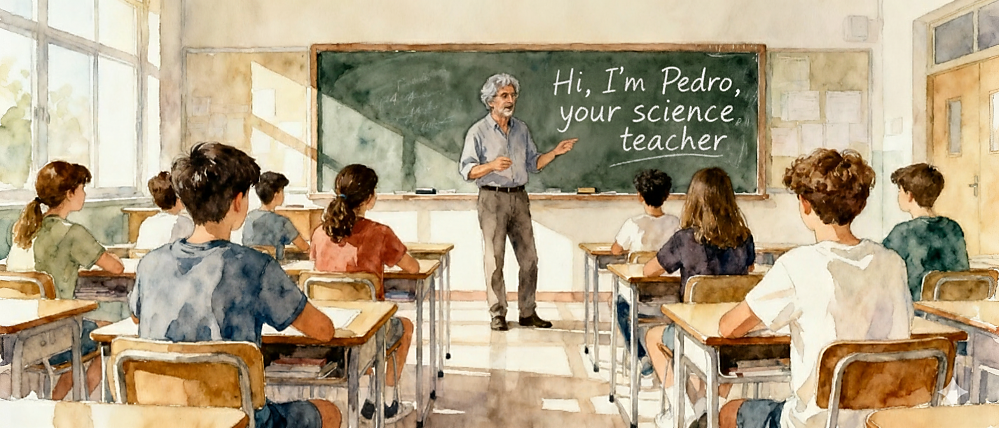
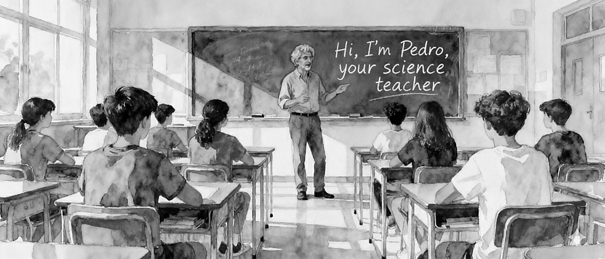

<div style="display: flex; gap: 2em; align-items: stretch; justify-content: space-between;">
<div style="flex: 50%;">

::: {.light-content}
{}
:::

::: {.dark-content}
{}
:::
</div>
<div style="flex: 50%;">
Hello, I'm Pedro and I'm studying a master's degree in secondary school teaching at Pompeu Fabra University. This website is a record of my learning and reflection process during this master's degree. Since my years as a free time instructor and later summer camp director, I have always been curious about the profession of educator, but life for many years has taken me down multiple paths.

Upon returning after 14 years working in England, teaching was one of my first options to reinvent myself upon my return home.

I recently saw a movie, one of those not very famous ones, but with a great message. That film is Lunana, a yak at school and there is a central phrase about the impact of the teacher that said: [Teachers can touch the future of their students]{style="font-size: 1em; font-weight: bold;"} and the truth is that it had a great impact on me and now after embarking on this process I have realized that it can be like that, and that education is one of the most powerful tools to transform lives.

So here I am, reinventing myself once again to become a good educator and be able to apply all my life experience and scientific knowledge that I have been acquiring all these years as a mining exploration geologist, later a company director, and now returning to explore hydrocarbons for more than half the world in the future of our society, our children.
</div>
</div>

```{=html}
<div style="display: flex; gap: 10px; flex-wrap: wrap; justify-content: center; margin-top: 20px;">
    <a href="https://github.com/pedroGEOGIScoding/" target="_blank" style="text-decoration: none;">
        <button style="display: flex; align-items: center; gap: 8px; padding: 8px 16px; border: 1px solid #ddd; border-radius: 6px; background: white; cursor: pointer; font-size: 14px; color: #333; transition: all 0.2s;">
            <i class="bi bi-github" style="font-size: 18px;"></i> GitHub
        </button>
    </a>
    <a href="mailto:pedromartinezduran@gmail.com" target="_blank" style="text-decoration: none;">
        <button style="display: flex; align-items: center; gap: 8px; padding: 8px 16px; border: 1px solid #ddd; border-radius: 6px; background: white; cursor: pointer; font-size: 14px; color: #333; transition: all 0.2s;">
            <i class="bi bi-envelope" style="font-size: 18px;"></i> Email
        </button>
    </a>
    <a href="https://www.linkedin.com/in/pedromartinezduran/" target="_blank" style="text-decoration: none;">
        <button style="display: flex; align-items: center; gap: 8px; padding: 8px 16px; border: 1px solid #ddd; border-radius: 6px; background: white; cursor: pointer; font-size: 14px; color: #333; transition: all 0.2s;">
            <i class="bi bi-linkedin" style="font-size: 18px;"></i> LinkedIn
        </button>
    </a>
    <a href="master-upf/about/about-this-me.qmd" style="text-decoration: none;">
        <button style="display: flex; align-items: center; gap: 8px; padding: 8px 16px; border: 1px solid #ddd; border-radius: 6px; background: white; cursor: pointer; font-size: 14px; color: #333; transition: all 0.2s;">
            <i class="bi bi-person" style="font-size: 18px;"></i> About me
        </button>
    </a>
</div>
```

---

::: {.intro-text}
To learn more about my professional trajectory, you can visit the "About me" tab in the navigation bar or if you prefer you can click [here](master-upf/about/about-this-me.qmd). Also, if you are interested in how I created this website for my UPF Master's portfolio, you can visit the "About this site" section in the navigation bar or if you prefer you can click [here](master-upf/about/about-this-site.qmd). For information about the images used on this website, you can visit the "Image Credits" section in the navigation bar or if you prefer you can click [here](master-upf/about/about-this-images-credit.qmd).
:::

---
```{=html}
<div style="display: flex; gap: 2%; justify-content: space-between; align-items: stretch;">
  <!-- Weather Map -->
  <div style="flex: 1 1 48%; display: flex; flex-direction: column; height: 550px;">
    <p style="font-size: 1.5em; font-weight: bold; text-align: center; margin: 0 0 10px 0;">Weather Map</p>
    <iframe style="flex: 1; height: 100%;" width="100%" src="https://embed.windy.com/embed.html?type=map&location=coordinates&metricRain=mm&metricTemp=°C&metricWind=km/h&zoom=5&overlay=rain&product=ecmwf&level=surface&lat=38.479&lon=0.703&detailLat=41.509&detailLon=2.285&detail=true&pressure=true&message=true" frameborder="0"></iframe>
  </div>
  
  <!-- Science News -->
  <div style="flex: 1 1 48%; display: flex; flex-direction: column; height: 550px;">
    <p style="font-size: 1.5em; font-weight: bold; text-align: center; margin: 0 0 10px 0;">Latest Science News</p>
    <iframe src="https://feed.mikle.com/widget/v2/176215/?preloader-text=Loading&" height="642px" width="100%" class="fw-iframe" scrolling="no" frameborder="0"></iframe>
  </div>
</div>
```