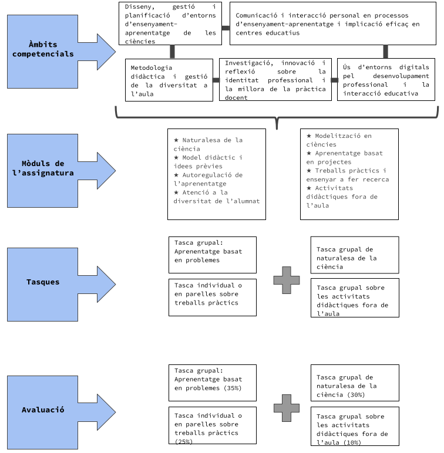

## Presentation

* The main objective of this subject is to work on the fundamental bases of science teaching. The aim is to promote science teaching-learning that promotes scientific literacy and, at the same time, encourages young people to opt for scientific careers.

* The aim is to encourage reflection on the science model to be taught and the teacher's didactic model, and also to provide the necessary tools and resources to be able to carry out the task of science teacher in accordance with current science teaching paradigms.

* Key aspects in the teaching-learning of sciences are worked on; This deepens the nature of science, reflects on the importance of the teaching model of the teachers and the students' previous ideas, on the self-regulation of learning, the role of language in the construction of knowledge, the importance of experimental or practical work and didactic activities outside the classroom and, finally, project-based learning.

* The importance of modeling in science and the treatment of diversity are aspects that will be taught with the problem-based learning (PBL) methodology. The learning process begins with a problem situation that promotes the identification of learning needs. You will work with groups of 8-10 students with a tutor as a learning facilitator. The learning process is directed by the students themselves. At the end of each of the two problems, the results will be presented to the rest of the classmates.

* All the contents and procedures that will be worked on in this subject will be basic resources for the design of didactic sequences that will be carried out in the DEIA subject.

 

{width=50% fig-align="center" group="fac-inicio" loading="lazy"}

 

## Technical Information

* **Subject code:** 32438

* **Timing:**
  - Full time: first and second semester
  - Part time: first year, annual

* **Number of credits:** 10

* **Dedication:** 75 hours in person and 120 hours of autonomous work (195 hours total)

* **Teachers:** Pineda Badia (coordinator), Marcel Costa, Jordi de Manuel, Anama Domènech, Laura Ganzer, Xavier Muñoz, Xavier Oller, Nora Pérez, Xavi Pié, Diego Sanjulián, Laura Taberner, Gemma Viscasillas

 

## Subject Modules

* **Nature of science**

* **Didactic model and previous ideas**

* **Self-regulated learning**

* **Attention to the diversity of the students**

* **Modeling in science**

* **Project-based learning**

* **Practical work and teaching how to do research**

* **Didactic activities outside the classroom**

 

## Goals

* Know and apply the analysis of the nature of science to secondary school class sessions.

* Be aware of the importance of preconceptions in science teaching.

* Analyze the teaching model itself and contrast it with that of the teachers of the 20th century. XXI.

* Know the requirements to carry out experimental work and research in science teaching.

* Apply self-regulation as a learning tool.

* Know the relevance of language in the construction and communication of scientific knowledge.

* Apply modeling as a learning strategy in science classes

* Use questions didactically in science classes.

* Apply the most appropriate strategies to address the diversity of students in science class.

* Identify the requirements and implications of work through transversal projects and in the context of science.

* Efficiently use learning and knowledge technologies in science teaching.

* Know how to plan and analyze didactic activities outside the classroom.

 

## Competencies

1. Design, management and planning of science teaching-learning environments

2. Communication and personal interaction in teaching-learning processes and effective involvement in teaching teams.

3. Teaching methodology and diversity management in the classroom

5. Research, innovation and reflection on professional identity and the improvement of teaching practice

6. Use of digital environments for professional development and educational interaction

 

## Contents

* Introduction to the nature of science.

* Consequences of preconceptions of the nature of scientific knowledge in science teaching.

* The teaching model of teachers.

* Experimental work in science teaching.

* Teach how to do research

* Self-regulation of learning.

* Language in the construction and communication of scientific knowledge.

* Strategies to promote citizen participation in science

* Modeling in science teaching

* Questions in science classes.

* Attention to the diversity of students in science class.

* Project work.

* The use of learning and knowledge technologies in science teaching.

* Didactic activities outside the classroom: planning and analysis.

 

## Methodology

### a) Face-to-face sessions

* The sessions will be theoretical-practical, activities to work in the classroom will be combined with presentations by the teachers. Active learning methodologies will therefore predominate and reflective practice will be facilitated.

* A good part of the tasks that will be carried out in person during classes will be carried out working in cooperative groups.

* Some of the topics of this subject are worked with the problem-based learning methodology.

* The student will have at their disposal on the virtual platform the presentations and documents used during the sessions and complementary information on each topic.

### b) Non-face-to-face tasks

* Students will have various documents at their disposal on the Virtual Platform that will be used to prepare different tasks (individual or group); These tasks must contribute to achieving the objectives of the subject.

### c) Practical sessions

* During the course there will be some practical sessions in the laboratories of the Faculty of Health and Life Sciences (FCSV). Students will be required to wear a gown for these sessions. There will also be a field trip to Collserola that will take place in the morning.

### d) Scheduled visits

* Two trips will be made to scientific institutions where educational activities are carried out for secondary school students, with the aim of learning about the resources that these types of centers offer for students and teachers of natural sciences and working on how to make good use of them.

 

## Assessment

* The subject will have a continuous evaluation system, which will be based on the demands made during the teaching process.

The evaluation activities will be the following:

* **Group task: Problem-based learning (35%)**

* **Individual or pair homework on practical work (25%)**

* **Nature of science group task (30%)**

* **Group task on didactic activities outside the classroom (10%)**

 

## Resources and Recommended Bibliography

Adell, J. 2010. Congress models of ICT integration in education. http://www.ite.educacion.es/congreso/modelostic/

Barba, C., Capella S. 2010. Ordinadors ales aules. The key is the methodology. Guix Library, 172. Barcelona. Ed. Graó.

Barberà, E., Mauri, T., Onrubia, J. 2008. How to assess the quality of teaching based on ICT. Guidelines and analysis instruments. Criticism and foundations, 19. Barcelona. Ed. Graó.

Borrull Riera, A.; Valls Bautista, C., 2019. Low cost science. Practical guide to inquiry activities on life sciences for secondary school. Ed. Graó. Didactic series of experimental sciences. no. 330

Cerezo, JM. 2008. Towards a new paradigm. The age of fragmented information. Telos, innovation and communication notebooks., 76. Madrid. Telefónica Foundation.

Claxton, G. 1994. Educating curious minds. Barcelona. Ed. Visor.

Couso, D., Jimenez-Liso, M.R., Refojo, C. & Sacristán, J.A. (Coords) (2020) Teaching Science with Science. FECYT & Lilly Foundation. Madrid: Penguin Random House. (https://www.fecyt.es/es/publicacion/ensenando-ciencia-con-ciencia)

Chalmers, 1987 What is this thing called science? 21st century: Madrid

De Manuel, J. 2000. Educate curiosity. The research from childhood to secondary school. Guix, 263 pp. 35-40.

Dagher, Z. R., & Erduran, S. (2016). Reconceptualizing the nature of science for science education. Science & Education, 25(1-2), 147-164.

Domènech, M. 2008. The secondary science classroom: from the information and communication technologies (ICT) to the learning and knowledge technologies (TAC), from the continguts to the competencies. Ciències Magazine, 11 pp 20-22.

Domènech, J. (2019). Learn based on projects, practical tasks and controversies. 28 proposals and reflections for teaching Sciences. Marta Mata Pedagogy Award 2018. Rosa Sensat.

Driver,, R. et al. (1991). Scientific ideas in childhood and adolescence. Madrid: Ed. Morata/MEC.

González Aguado, Mª Elvira (coord.), 2013. 84 everyday chemistry experiments in secondary school. Ed. Graó. Alembic Library. Didactic series of experimental sciences. No. 302

Harlen, W. (2010). Principles and big ideas of science education. Ed. Rosa Devés (www.innovec.org.mx)

Hernández, F. 2004. Passion for the process of knowing: Project work. Pedagogy Notebooks, 332. P. 46-51.

Izquierdo, M., Aliberes, J., 2004. Think, act and write in the science class. For a rational and reasonable teaching of sciences. Cerdanyola: UAB Publications.

Jimenez-Aleixandre (coord). 2003. Teaching science. Graó.

Lemke J.L. 1997. Learning to speak science, Barcelona: Ed. Paidós.

Lozano, O. R i Solbes, J., 2014. 85 everyday physics experiments. Ed. Graó. Alembic Library. Didactic series of experimental sciences. No. 305

Lucio Gil, R., & Sanmartí, N. (2004). Metacognitive activity as a trigger for self-regulatory processes in the conceptions and teaching practices of experimental science teachers. Autonomous University of Barcelona.

Manent, M. 2011. Excursions and activities in primary and secondary schools. 15 medi natura sortides. Dossiers Rosa Sensat, 73. Barcelona. Publications of the Rosa Sensat Teachers Association.

Mayer, R.E. (2020). Applying the science of learning. Ed. Graó.

Molés, J.; Montferrer, Ll. 2014. Flipped Classroom al laboratori. Ciències, 27. pp. 9-15.

Monereo, C.; Duran D. 2001. Entramats. Cooperative and collaborative learning methods. Barcelona. Edebe.

Monereo, C.; 2005. Internet and basic skills. Learn to collaborate, to communicate, to participate, to learn. Barcelona. Ed. Graó.

Monereo, C., Pozo J. 2007. Basic competencies. Pedagogy notebooks, 370.

McComas, W. F., de., 1991. The Nature of Science in Science Education. Rationales and strategies. Dordrecht: Kluwer.

Novak, J.D. & Gowin, 1988. Learning to learn. Barcelona: Ed. Martinez Roca.

Ogborn, J. et al. 1998. Ways to explain. Teaching science in secondary school. Madrid: Classroom XXI Santillana.

Osborne, J., Pimentel, D., Alberts, B., Allchin, D., Barzilai, S., Bergstrom, C., Coffey, J., Donovan, B., Kivinen, K., Kozyreva. A., & Wineburg, S. (2022). Science Education in an Age of Misinformation. Stanford University, Stanford, CA.

Prensky, M. 2004. The emerging online life of the digital native. http://www.marcprensky.com/writing/

Pujolàs, P. 2003. Learn together with different students. Cooperative learning teams in the classroom. Vic. Eumo Editorial.

Pujolàs, P. 2009. 9 key ideas: Cooperative learning. Vic. Eumo Editorial.

PISA. 2006. Assessment Framework: Knowledge and Skills in Science, Mathematics and Reading: Program for International Student Assessment. OECD Publications.

Ruiz, H. 2020. How do we learn? A scientific approach to learning and teaching. Ed. Graó.

Sanmartí, N. (2007). 10 Key Ideas. Evaluate to Learn. Madrid: Ed. Graó.

Sanmartí, N., 2002. Science teaching in compulsory secondary education. Education Synthesis.

Sanmartí, N. The work of researching batxillerat. http://www.xtec.cat/sgfp/matform/matrecerca/neussanmarti.pdf

Seré, M.G., Leach, J., et al. 2001. Improving science education: issues and research on innovative empirical computer-based approaches to laboratory work in Europe. Project PL 95-2005, Labwork in Science Education. Final report European Commission. Socioeconomic research programme.

Tamir, P. 1989. Training teachers to teach effectively in the laboratory. Science Education, 73(1) pp 59-69.

Valls, J. M. i Segura, M., 2014. La clau de volta. Resources for professors of Experimental Sciences. Pious School of Catalonia.

VVAA. 2000. Monograph: Science Museums. Alembic, 26. Barcelona. Ed. Graó.

VVAA. 2004. Monograph: Practical work in physics and chemistry. Alembic, 39. Barcelona. Ed. Graó.

VVAA. 2005. Monograph Contextualizing science. Alembic, 46. Barcelona. Ed. Graó.

VVAA. 2006. Monograph: Practical work in the construction of biological and geological knowledge. Alembic, 47. Barcelona. Ed. Graó.

VVAA. 2007. Monograph: Teaching and learning by researching. Alembic, 52. Barcelona. Ed. Graó.

VVAA. 2015. Monograph: More on materials. School Perspective, 383.

VVAA. 2017. Monograph: Learning based on projects in STEM fields. Ciències, 33. p 1-56.

VVAA, 2012. Alembic. Didactics of Experimental Sciences. Teaching what science is, number 72

VVAA, 1996. Monograph: The ideas of students in science. Alembic, 7. Barcelona. Ed. Graó.

VVAA,. 2008. Monograph: The PISA assessment in science. Alembic, 57. Barcelona. Ed. Graó.

 

## Online Resources

ARC, space to share quality teaching proposals associated with basic competencies and the curriculum: https://apliense.xtec.cat/arc/

CESIRE (Support Center for Educational Innovation and Research): https://serveiseducatius.xtec.cat/cesire/

Catalan webquest community: http://webquestcat.net/

Project work: http://xtec.gencat.cat/ca/curriculum/xarxacb/treball-projectes/

Planning practical work:
- http://www.xtec.cat/~rgrau/
- https://www.ub.edu/paubiologia/Recursos/Disseny%20_experimental.pdf
- http://www.ciencianet.com/experimentos.html

