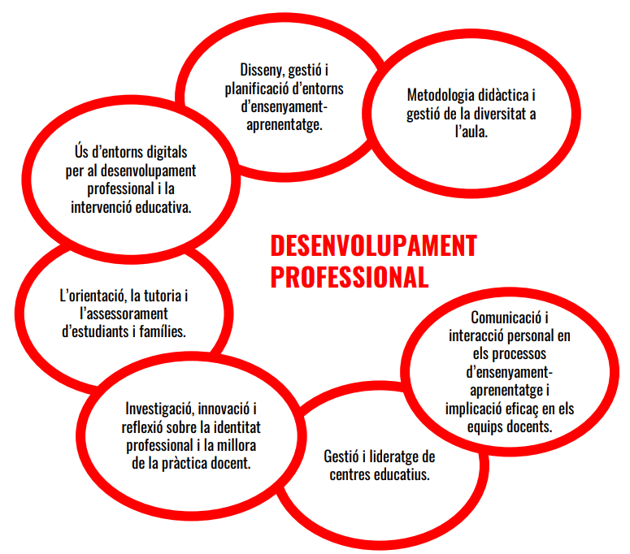
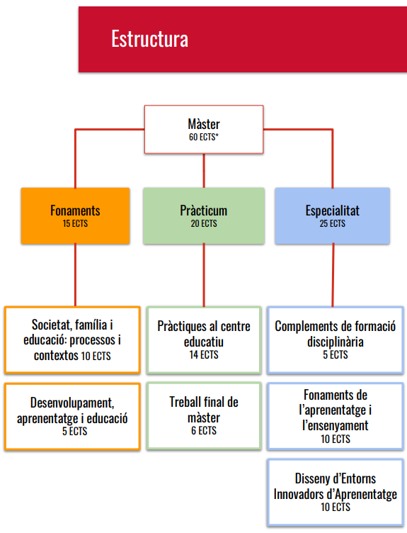
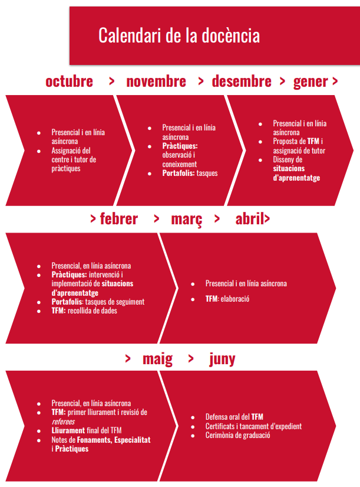

## General Information

* The objective of the UPF master's degree in teaching is to train competent professionals prepared for the current and future challenges of education. Throughout the course, you will work on the key competencies to be a teacher and you will review and mature both the conceptions of teaching-learning and the nature of the knowledge of your specialty, sharing the experience with your course mates.

* This master's degree has a globalized and holistic approach, with experiential, collaborative learning based on reflective practice. Participation in the practicum in centers and the support of mentors are a key piece of professional growth, complemented by classes at the university, online and in person.

* These are the seven areas of competence that you will work on transversally in the different subjects. As a professionalizing master's degree, these areas cover the various aspects of the teaching task: communication, management, guidance, research and reflection on personal practice, in addition to the design of the apprentices' learning sequences. The evidence of the acquisition of these skills will be collected in the projects and activities that you will do in the subjects, in the practicum portfolio and in the master's thesis.

{width=50% fig-align="center" group="intro-master-upf"}

{width=50% fig-align="center" group="intro-master-upf"}

{width=50% fig-align="center" group="intro-master-upf"}

{width=50% fig-align="center" group="intro-master-upf"}

## Credits and dedication

* Each ECTS (European Credit Transfer System) corresponds to approximately 25 hours of work (in the face-to-face or virtual classroom and independently)

* The total of the master's degree corresponds to approximately 1,500 hours of dedication

* You can complete the master's degree in one or two years, depending on personal or work circumstances.

## Stake

* In all subjects it is necessary to constantly participate in activities, personal work, team collaboration (inside and outside the classroom), and punctuality in the delivery of assignments.
* In the specialties of Natural Sciences, English and Catalan-Spanish it is necessary to attend a minimum of 85% of the contact hours, in all subjects and in the Practicum.

## Assessment

* The final grade of the master's degree is based on the number of credits assigned to each module, as shown in the previous diagram: 15 credits for Fundamentals, 25 credits for Specialty and 20 credits for Practicum

* To pass the master's degree it is necessary to pass ALL the Fundamentals, Specialty, Practicum and final master's thesis (TFM) subjects.

* If you use Generative Artificial Intelligence (GAI) to prepare a fragment, image, activity, etc., it is necessary to mention it explicitly, writing a specific section in the bibliography explaining the use made of the GIA and referencing these parts following the APA guidelines in this regard (You can find this information on the UPF CRAI website and, especially, the citation section for these cases). In case of misuse of the IAG, the corresponding task or work will be considered suspended.

## Practicum

* The university coordinates the assignment of students with the centers and assigns each one a mentor (a volunteer teacher from the center, of the corresponding specialization) and a tutor from the university

* Students who have a work or personal relationship with a center cannot take the Practicum there.

## Teaching staff

* Pineda Badia, Bernat Blasco, Arturo Corts, Marcel Costa, Xavier Muñoz, Lluís Pagès, Gemma Viscasillas, Anna Torras, Gemma Serra, Jordi Soler, Jordi de Manuel, Anama Domènech, Sílvia Marro, Iván Marchán, Lluís Terrado, Laura Taberner, Xavier Oller, Teresa Martínez, Núria Domènech, Laura Farr, Jessica Fernández, Laura Ganzer, Davínia Hernández-Leo, Sílvia Lope, Laia Ramon, Diego Sanjulian