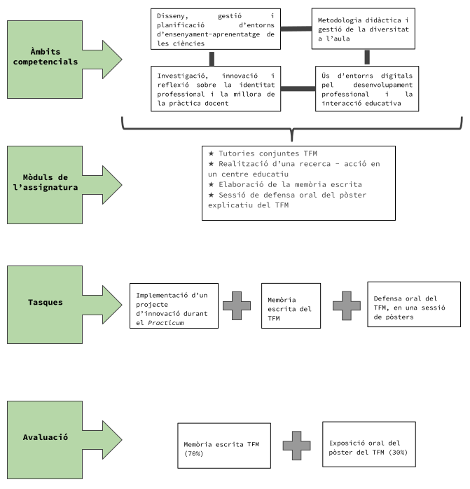

## Presentation

* In the Master of Teacher Training in Compulsory Secondary Education and Baccalaureate, Vocational Training and Language Teaching, the student must develop a Master's Final Project (TFM) under the supervision of the university tutor. The workload involved in this work is 6 credits (ECTS), which approximately corresponds to 150 hours of student work.

* The Master's Final Project is understood as an exercise of synthesis, integration and deepening of all the knowledge and skills acquired during the master's degree, and consists of the development of a topic in depth and exhaustively. This topic must necessarily be of interest to the student and related to the teaching practice of their specialty. The focus of this work must be fundamentally the bibliographic exploration, the analysis of the situation in the classroom during the practicum and the formulation, application and analysis of the impact of innovative educational and didactic proposals in the context of the internship educational center.

* During the development of the TFM, the student must connect the topic on which he develops the work with the contents covered in the generic module and the specialization module, as well as with everything he has seen and learned in the practicum stay.

 

## Technical Information

* **Subject code:** 32022

* **Timing:**
  - Full time: first and second semester
  - Part time: second year, annual

* **Number of credits:** 6

* **Dedication:** 150 hours of work

* **Teachers:** Laura Ganzer (coordinator) and university tutors

 

{width=50% fig-align="center" group="practicas-tfm" loading="lazy"}

 

## Subject Modules

* **TFM joint tutoring**

* **Conducting an action research in an educational center**

* **Preparation of the written report**

* **Oral defense session of the TFM explanatory poster**

 

## Goals

* Be able to apply the knowledge acquired during the master's degree around a topic that acts as an integrating axis related to professional practice and educational innovation.

* Deepen your knowledge of a specific topic in relation to the professional practice experienced at the internship center.

 

## Competencies

* In general terms, the areas of competence that will be worked on throughout the TFM are those indicated below. Depending on the specific topic of the action research that is carried out, one or another competency in the indicated areas will be developed.

1. Design, management and planning of science teaching-learning environments

3. Teaching methodology and diversity management in the classroom

5. Research, innovation and reflection on professional identity and the improvement of teaching practice

6. Use of digital environments for professional development and educational interaction

 

## Methodology

* The final master's thesis (TFM) consists of carrying out an action research to introduce an improvement in some aspect related to science classes in secondary school, always within the framework of the units and/or didactic sequences designed in DEIA.

* The TFM will be carried out with the internship couple or individually.

* During the first internship at an educational center, the student must focus on some aspect that could be improved in science classes and develop one or more research questions.

* Throughout the DEIA sessions and independent work, a bibliographic search on the topic will be carried out and educational actions that will supposedly lead to an improvement in science classes will be designed. During the second internship, within the framework of the teaching units and/or sequences that the student implements with the groups of students that the mentor has assigned to him/her, the educational actions linked to the TFM will be carried out, and the results will be observed and data collected.

* Subsequently, the analysis of these data should allow us to assess whether or not the didactic intervention carried out represents an improvement in science classes, answering the research question initially posed and allowing the elaboration of the conclusions of the TFM.

* Throughout the entire process of completing the TFM, two joint tutorials will be carried out by the tutor and his or her group of students to assess their development and carry out co-evaluation actions. Individualized tutorials can also be carried out with the tutor.

* The presentation of the TFM will be done through a written report that will be delivered electronically and its defense will be carried out in a poster session at the end of the course.

 

## Assessment

* To be able to present the TFM, it is recommended to have positively passed the evaluation of the subjects of the fundamentals of secondary education and teaching specialization modules, and it is mandatory to obtain a positive grade in the evaluation of the practicum. If the practicum has been suspended, the defense of the TFM will be done the following academic year, with the same calendar as the rest of the students and always depending on the completion of the practicum.

* The student will make a first delivery of the TFM, which will be reviewed by the tutor and a referee (external reviewer). These will review the different parts of the TFM and, if appropriate, make proposals for improvement, and will recommend or not accept it. From this moment, students have one week to make the necessary amendments and send the final version of the TFM.

* In the month of June, the presentations of the TFMs of all specialties will take place. They will be presented in person in public poster sessions. The TFM will be evaluated by a Tribunal made up of three Master's professors, through the written report and its public oral defense. This court must include the student's mentor and the University tutor. Thus, the TFM evaluation panel will be made up of: the center's mentor/tutor, the university tutor and a master's professor from the university.

### Evaluation weighting

* **TFM written memory (70%)**

* **Oral presentation of the TFM poster (30%)**

 

## TFM structure

### Written memory (70%)

The written report must include:

* Bibliographic exploration on the topic

* Analysis of the situation in the classroom during the practicum

* Formulation of research questions

* Design of innovative educational actions

* Implementation and data collection

* Analysis of results

* Conclusions and proposals for improvement

### Oral defense of the poster (30%)

The oral defense will take place at:

* Public poster session

* Presentation before the evaluating court

* Answer to court questions

 

## TFM Completion Process

### First internship stay (January - February)

* Observation and analysis of classroom functioning

* Identification of aspects that could be improved in science classes

* Development of research questions

### During DEIA sessions

* Bibliographic search on the chosen topic

* Design of innovative educational actions

* Action research planning

### Second internship stay (March - May)

* Implementation of educational actions linked to the TFM

* Observation of results

* Data collection

* Analysis of the didactic intervention

### Preparation of the memory

* Writing the written report

* First delivery and review by tutor and referee

* Incorporation of suggested improvements

* Final version delivery

### Defense of the TFM (June)

* Preparation of the explanatory poster

* Public presentation in court

* Oral defense and answer to questions
