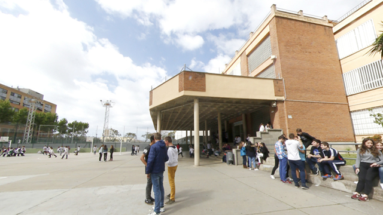

# My image of the center and my mentor's didactic activity

My internship center, the "Los Gabrielistas" charter school, is located in the town of Viladecans. My internship mentor is called Carlos Giménez Esteban and he has a degree in biology with 35 years of teaching experience, all of them at this same school.

Carlos's educational activity focuses on 4 years of ESO and the two high school courses. From 4th of ESO it only teaches scientific culture and in high school it is in charge of subjects related to biology, the mathematics of 2nd from high school, and current scientific challenges of biology-geology. The last two days of the first week and the first 2 of the second week of practices coincided with the first quarter exams and the following Wednesday after the exams was the high school class excursion. This has meant that, during those days, classes were focused on reviewing and preparing for exams, which made the dynamics very different from usual.

::: {style="display: flex; gap: 0.5em; align-items: stretch; justify-content: space-between;"}
::: {style="flex: 50%;"}

:::

::: {style="flex: 50%;"}

:::
:::

## Overview of the Sant Gabriel de Viladecans School

The **Sant Gabriel de Viladecans School** is a concerted educational center located in Viladecans. It is an institution run by the religious congregation of the Brothers of San Gabriel, which is part of the Gabrielist educational community with more than 100 years of educational history. The truth is that it does not differ much from the school I went to, which was also a Catholic charter school, except for the generational leap of the students. Apart from this obvious temporal aspect, I have to say that the difference is almost nil. So the image I take with me from school is the same as the one I had from the school I went to, the truth is that these practices have brought back many memories of my school days.

Being a charter school for ESO, but not for high school, the economic barrier creates a social barrier that is possibly one of the reasons for the almost non-existent conflict in the classrooms. Another aspect is the location of the school in an area of ​​newly built housing or medium-high priced housing. These two aspects mark the profile of the families that come to study at the school. This statement does not mean that a comfortable or problem-free economic status *per se* cannot generate conflict, but in my personal experience in this practicum this has not been the case. What is clear is that the school has a very strong history in Viladecans since with its 100 years of educational history in the town, the school is an educational center with a great tradition and considered prestige among the population of Viladecans. Around the school, every afternoon there is a lot of extracurricular sports activity and I get the impression that it is as if it were a social meeting place in that central area of ​​Viladecans.

### Identity and Educational Project

The Gabrielists constitute an educational community whose main objective is to prepare students for their future, encouraging them to freely and responsibly integrate Christian attitudes and values ​​into their lives. The school promotes the comprehensive formation of students according to a Christian conception of the person, preparing them to actively participate in the improvement and transformation of society. It is a school open to everyone without any type of discrimination, inserted in the sociocultural reality of Catalonia with a commitment to service, working from a comprehensive school that addresses the diversity of abilities, interests and learning rhythms.

### Educational Offer

The center offers a complete educational itinerary from 3 years old to post-compulsory studies:

**Early Childhood Education** (3 to 6 years): Six units with a capacity of 25 students per classroom.

**Primary Education** (6 to 12 years): Twelve units organized in groups A and B per course, with a capacity of 25 students per classroom.

**Compulsory Secondary Education - ESO** (12 to 16 years old): Eight units distributed in courses from 1st to 4th, with a capacity of 25 students per classroom.

**Baccalaureate** (from 16 years old): Scientific-Technological Modalities and Humanities-Social Sciences, with two units and capacity of 35 students per classroom.

**Vocational Training** (from 16-18 years old): Training Cycles are specific studies aimed at providing professional skills and preparing the student for entering the world of work or higher education. The school offers:

-   **Medium Grade**: Guide in the natural environment and free time, and Electromechanics of motor vehicles in DUAL FP mode.
-   **Higher Degree**: Teaching and socio-sports animation, and Automotive in DUAL FP modality.

### Educational Projects

The school develops several transversal projects:

**Gabrielist Classroom**: Structuring the set of learning and classroom work techniques.

**Multilingual Project**: Preparation of students to interact in a diverse social and cultural environment.

**Reading Plan**: Promotes reading competence and the acquisition of a taste for reading.

**Sustainability**: Action for the development of a comprehensive ecology, being recognized as a Green School.

**Health Program**: Resources and values ​​for the comprehensive promotion of health, permanently connected with the Hospital de Nens de Barcelona Foundation.

**Social Cohesion**: Promotion of an affectionate and family climate from an inclusive vision.

### Extracurricular Activities and Services

The school offers a wide program of extracurricular activities that includes: Programming and Robotics, Theater, MiniMúsics, English, Guitar, and various sports activities such as Taekwondo, Paddle Tennis, Swimming, Skating and Dance. During the summer, it organizes multi-sports and specific dance and paddle tennis camps for children from 3 to 13 years old. The center has a school cafeteria service with healthy menus, and offers additional services such as the Oxford Test of English to certify English level, a guidance department, and the sale of books and uniforms through an online store. The school is currently celebrating its centenary (1925-2025), highlighting its long educational history serving the community of Viladecans.

