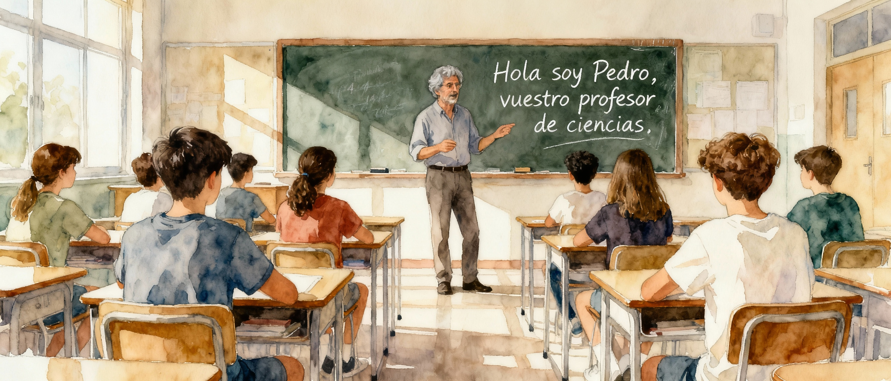

```{=html}
<style>
  /* Intro: image + text */
  .home-intro {
    display: flex;
    gap: 2em;
    align-items: stretch;
    justify-content: space-between;
    flex-wrap: wrap;
  }
  .home-intro-col {
    flex: 1 1 320px;
    min-width: 0;
  }

  /* Dashboard widgets: weather map + science news */
  .home-widgets {
    display: flex;
    gap: 2%;
    justify-content: space-between;
    align-items: stretch;
    flex-wrap: wrap;
  }
  .home-widget {
    flex: 1 1 48%;
    min-width: 300px;
    display: flex;
    flex-direction: column;
    height: 550px;
  }

  @media (max-width: 768px) {
    .home-intro {
      flex-direction: column;
      align-items: stretch;
      gap: 1em;
    }
    .home-intro-col {
      flex-basis: auto;
    }
    .home-widget {
      flex-basis: 100%;
      height: 450px;
    }
  }
</style>
```

::::::: home-intro
::::: home-intro-col
::: light-content

:::

::: dark-content

:::
:::::

::: home-intro-col
Hola, soy Pedro y estoy estudiando el máster de profesor de secundaria en la universidad Pompeu Fabra. Este sitio web es un registro de mi proceso de aprendizaje y reflexión durante este máster. Desde mis años como monitor de tiempo libre y más tarde director de campamentos de verano, siempre he tenido curiosidad por la profesión de educador, pero la vida durante muchos años me ha llevado por múltiples derroteros.

Al volver después de 14 años trabajando en Inglaterra, la docencia fue una de mis primeras opciones para reinventarme a mi vuelta a casa.

Hace poco vi una película, de esas poco famosas, pero con un gran mensaje. Esa película es Lunana, un yak en la escuela y hay una frase central sobre el impacto del profesor en los alumnos que dice así: [Los profesores pueden tocar el futuro de sus alumnos]{style="font-size: 1`em; font-weight: bold;"} y la verdad es que me impactó muchísimo y ahora después de embarcarme en este proceso me he dado cuenta de que puede ser así, y que la educación es una de las herramientas más poderosas para transformar vidas.

Así que aquí estoy, reinventándome una vez más para convertirme en un buen educador y poder revertir toda mi experiencia vital y conocimientos científicos que he ido adquiriendo todos estos años como geólogo de exploración minera, más tarde director de empresas y volver a explorar hidrocarburos por más de medio mundo en el futuro de nuestra sociedad, nuestros hijos.
:::
:::::::

```{=html}
<div style="display: flex; gap: 10px; flex-wrap: wrap; justify-content: center; margin-top: 20px;">
    <a href="https://github.com/pedroGEOGIScoding/" target="_blank" style="text-decoration: none;">
        <button style="display: flex; align-items: center; gap: 8px; padding: 8px 16px; border: 1px solid #ddd; border-radius: 6px; background: white; cursor: pointer; font-size: 14px; color: #333; transition: all 0.2s;">
            <i class="bi bi-github" style="font-size: 18px;"></i> GitHub
        </button>
    </a>
    <a href="mailto:pedromartinezduran@gmail.com" target="_blank" style="text-decoration: none;">
        <button style="display: flex; align-items: center; gap: 8px; padding: 8px 16px; border: 1px solid #ddd; border-radius: 6px; background: white; cursor: pointer; font-size: 14px; color: #333; transition: all 0.2s;">
            <i class="bi bi-envelope" style="font-size: 18px;"></i> Email
        </button>
    </a>
    <a href="https://www.linkedin.com/in/pedromartinezduran/" target="_blank" style="text-decoration: none;">
        <button style="display: flex; align-items: center; gap: 8px; padding: 8px 16px; border: 1px solid #ddd; border-radius: 6px; background: white; cursor: pointer; font-size: 14px; color: #333; transition: all 0.2s;">
            <i class="bi bi-linkedin" style="font-size: 18px;"></i> LinkedIn
        </button>
    </a>
    <a href="master-upf/about/about-this-me.qmd" style="text-decoration: none;">
        <button style="display: flex; align-items: center; gap: 8px; padding: 8px 16px; border: 1px solid #ddd; border-radius: 6px; background: white; cursor: pointer; font-size: 14px; color: #333; transition: all 0.2s;">
            <i class="bi bi-person" style="font-size: 18px;"></i> Acerca de mí
        </button>
    </a>
</div>
```

------------------------------------------------------------------------

::: intro-text
Para saber más de mi trayectoria profesional, puedes visitar la pestaña "Acerca de mí" que está en la barra de navegación o si quieres, puedes cliquear [aquí](master-upf/about/about-this-me.qmd). También, si te interesa cómo he realizado esta página web para mi portafolio del Master UPF, puedes visitar la pestaña "Acerca de mí" que está en la barra de navegación o si quieres, puedes cliquear [aquí](master-upf/about/about-this-site.qmd). Por el tratamiento de las imágenes que están en esta página web, puedes visitar la pestaña "Acerca de mí" que está en la barra de navegación o si quieres, puedes cliquear [aquí](master-upf/about/about-this-images-credit.qmd).
:::

------------------------------------------------------------------------

```{=html}
<div class="home-widgets">
  <!-- Weather Map -->
  <div class="home-widget">
    <p style="font-size: 1.5em; font-weight: bold; text-align: center; margin: 0 0 10px 0;">Mapa del tiempo</p>
    <iframe style="flex: 1; height: 100%; width: 100%; border: 0;" src="https://embed.windy.com/embed.html?type=map&location=coordinates&metricRain=mm&metricTemp=°C&metricWind=km/h&zoom=5&overlay=rain&product=ecmwf&level=surface&lat=38.479&lon=0.703&detailLat=41.509&detailLon=2.285&detail=true&pressure=true&message=true" frameborder="0"></iframe>
  </div>
  
  <!-- Science News -->
  <div class="home-widget">
    <p style="font-size: 1.5em; font-weight: bold; text-align: center; margin: 0 0 10px 0;">Últimas noticias sobre ciencia</p>
    <iframe style="flex: 1; width: 100%; border: 0;" src="https://feed.mikle.com/widget/v2/176215/?preloader-text=Loading&" class="fw-iframe" scrolling="no" frameborder="0"></iframe>
  </div>
</div>
```