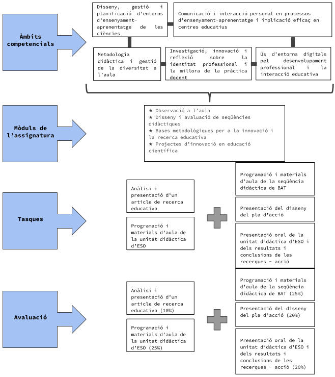

## Presentación

Los dos objetivos clave de esta materia son:

* Dar relevancia a la práctica reflexiva en la docencia y el día a día del profesor/a como método de transformación de la realidad y de mejora de los procesos de enseñanza-aprendizaje.

* Aprender el proceso de diseño y evaluación de situaciones de aprendizaje basadas en el modelo didáctico vigente, y contextualizados en el currículum del trabajo por competencias.

* El logro del primer objetivo, que implica el aprendizaje de la sistematización del proceso reflexivo, llevará a los alumnos a desarrollar el papel de profesor-investigador que fomenta la innovación docente.

* En el caso del segundo objetivo clave de la asignatura, su logro debe permitir a los estudiantes ser competentes en el proceso de programación de las diferentes materias y de diseño de las correspondientes sesiones, imprescindible para llevar a cabo la tarea docente.

* Algunos de los contenidos tratados son continuación, ampliación y aplicación de aspectos iniciados durante el primer trimestre en la asignatura de Fundamentos del Aprendizaje y la Enseñanza de las ciencias naturales.

* Se priorizará el enfoque práctico de las actividades que llevarán a cabo los estudiantes, de manera que la tarea final de la asignatura será la elaboración tutorizada de dos de los tres productos finales del máster: una situación de aprendizaje para ESO y una situación de aprendizaje para bachillerato, así como el diseño e implementación de una investigación-acción en el aula, que se llevarán a la práctica durante la segunda fase del prácticum, la cual permitirá a los estudiantes elaborar su trabajo final de máster (TFM). Siempre que sea posible, los estudiantes elaborarán, aplicarán y evaluarán en el aula por parejas los materiales didácticos y las acciones educativas desarrolladas en el marco de estos dos productos finales.

 

## Información Técnica

* **Código asignatura:** 32439

* **Temporización:**
  - Tiempo completo: primer y segundo semestres
  - Tiempo parcial: segundo año, anual

* **Número de créditos:** 10

* **Dedicación:** 65 h presenciales y 185 h de trabajo autónomo (250 h totales)

* **Profesorado:** Bernat Blasco, Marcel Costa, Eulàlia Durán, Laura Farró, Jèssica Fernández, Davínia Hernández-Leo, Sílvia Lope, Iván Marchán, Xavi Muñoz, Diego Sanjulián (coordinación), Gemma Serra, Jordi Soler.

 

{width=50% fig-align="center" group="deia-inicio" loading="lazy"}

 

## Módulos de la Asignatura

* **Observación en el aula**

* **Diseño y evaluación de secuencias didácticas**

* **Bases metodológicas para la innovación y la investigación educativa**

* **Proyectos de innovación en educación científica**

 

## Objetivos

* Elaborar la programación de situaciones de aprendizaje.

* Diseñar los materiales de aula para poder implementar situaciones de aprendizaje.

* Analizar los resultados de la implementación en el aula de las sesiones diseñadas.

* Proponer mejoras de los puntos débiles detectados durante la implementación de situaciones de aprendizaje.

* Identificar los aspectos a mejorar de la práctica educativa a través de la observación en el aula

* Analizar proyectos de innovación en educación científica

* Diseñar un ciclo de investigación-acción para implementar en el Prácticum

* Conocer el marco normativo y organizativo de la Formación Profesional en Cataluña. Interpretar y aplicar los elementos curriculares de la FP en la planificación y diseño de programaciones.

 

## Competencias

1. Diseño, gestión y planificación de entornos de enseñanza-aprendizaje de las ciencias

2. Comunicación e interacción personal en procesos de enseñanza-aprendizaje e implicación eficaz en los equipos docentes

3. Metodología didáctica y gestión de la diversidad en el aula

5. Investigación, innovación y reflexión sobre la identidad profesional y la mejora de la práctica docente

6. Uso de entornos digitales para el desarrollo profesional y la interacción educativa

 

## Contenidos

### Estructura de la programación de una secuencia didáctica

* Definición del enfoque de la secuencia y del contexto de aprendizaje

* Previsión de posibles obstáculos

* Descripción de la producción que deben llevar a cabo los alumnos

* Relación de los contenidos, su progresión y su relación con otras materias y otras partes de la materia

* Redacción de objetivos

* Concreción de las competencias globales, transversales, específicas del ámbito científico-tecnológico y ODS que se trabajarán

* Definición de los indicadores de éxito y criterios de evaluación

* Descripción de la secuencia de actividades, de su gestión de aula, temporización e instrumentos de evaluación

* Especificación de las medidas de atención a la diversidad, previsión de recursos necesarios y las conexiones con otras materias

### La investigación-acción en el aula

* La observación en el aula: objetivos, modelos de observación e instrumentos.

* La interrelación entre la práctica, la observación, la investigación educativa y la innovación.

* Los ciclos de investigación-acción y su relación con la propia formación como profesor/a.

* Tendencias actuales de la investigación en educación científica.

* Diseño y evaluación de innovaciones didácticas.

* Diseño de instrumentos de recogida de información para la investigación educativa.

* Análisis e interpretación de datos en la investigación educativa.

 

## Metodología

### a) Sesiones teórico-prácticas

* Esta asignatura tiene un carácter muy práctico y tiene una estrecha relación con el prácticum. Las clases están diseñadas para que los alumnos incorporen los conocimientos en sus prácticas docentes.

* Las sesiones serán de carácter práctico-teórico, lo que significa que los estudiantes estarán constantemente confrontados a experiencias y actividades concretas de aprendizaje, a partir de la reflexión de las cuales se irá construyendo gradualmente el saber teórico.

* En varias de las sesiones presenciales se realizará trabajo acompañado para la elaboración de las programaciones, materiales e intervenciones didácticas, que conforman los productos finales de la asignatura y del máster (una situación de aprendizaje en bachillerato, una situación de aprendizaje para la ESO y una investigación-acción de innovación didáctica), que posteriormente se llevarán al aula durante la segunda fase del prácticum.

* Los grupos de trabajo de prácticas, es decir, aquellos alumnos que diseñarán y aplicarán juntos estos productos, se formarán ya desde el inicio del máster y en función de la adjudicación de plazas para la realización de las prácticas en centro educativo.

### b) Tareas no presenciales

* Los estudiantes tendrán a su disposición en la Plataforma virtual documentos diversos. Buena parte de estas tareas se dirigirán a la elaboración de las diferentes partes de la secuencia didáctica de bachillerato y de la unidad de ESO. Las otras tareas no presenciales, que se elaborarán en el e-portafolio de los estudiantes, permitirán ir realizando el ciclo de investigación-acción encaminado a introducir una innovación didáctica: presentación y discusión de la pregunta de indagación, análisis de un artículo que fundamente la innovación y presentación del plan de acción.

### c) Exposiciones orales

* A finales del tercer trimestre del máster, después de haber experimentado en el aula la situación de aprendizaje de bachillerato y la situación de aprendizaje de ESO, y de la realización de la investigación-acción en el aula, se hará una exposición oral de los resultados. En estas exposiciones los estudiantes deberán hacer una síntesis de las características didácticas y actividades de la unidad de ESO, así como un especial énfasis en el análisis de los resultados obtenidos y las propuestas de mejora que consideren relevantes. Asimismo, en esta presentación se expondrán los resultados y conclusiones obtenidas de la innovación didáctica introducida durante la investigación-acción.

 

## Evaluación

* **Análisis y presentación de un artículo de investigación educativa (10%)**

* **Programación y materiales de aula de la unidad didáctica de ESO (25%)**

* **Programación y materiales de aula de la secuencia didáctica de BAT (25%)**

* **Presentación del diseño del plan de acción (20%)**

* **Presentación oral de la unidad didáctica de ESO y de los resultados y conclusiones de la investigación-acción (20%)**

 

## Recursos y Bibliografía Recomendada

### Bibliografía básica:

AAVV., 2013. Hacer unidades didácticas. Revista Alambique, nº74.

AAVV., 2016. Competències bàsiques de l'àmbit científico-tecnològic. Identificació i desplegament a l'ensenyament secundari obligatori. Publicacions del Departament d'Ensenyament. Generalitat de Catalunya.

AAVV., 2015. La progressions de enseñanzas. Revista Alambique, nº79.

AAVV., 2020. Programar per competències a l'educació secundària obligatòria. Direcció General de Currículum i Personalització. Publicacions del Departament d'educació.

Alba, C., Sánchez, J., Zubillaga, A. 2014. Diseño Universal para el Aprendizaje. Pautas para su introducción en el currículo. (http://www.educadua.es/doc/dua/dua_pautas_intro_cv.pdf)

Claxton, G. 1994. Educar mentes curiosas. Ed. Visor (Aprendizaje).Madrid.

Couso, D. 2013. La elaboración de unidades didàcticas competenciales. Revista Alambique, nº74, pp 12-24.

Jimenez-Aleixandre (coord). 2003. Enseñar ciencias. Graó.

Sanmartí, N., 2002. Didáctica de las ciencias en la educación secundaria obligatoria. Síntesis Educación.

### Bibliografía complementaria:

AAVV. 1997. Monografía: Las secuencias de contenidos en ciencias. Alambique, 14. Barcelona. Ed. Graó.

AAVV. 2011. Monografía: Hacia la competencia científica. Alambique, 70. Barcelona. Ed. Graó.

Couso, D. 2015. La clau de tot plegat: la importància de "què" ensenyar a l'aula de ciències. Ciències, 29. pp 29-36.

Couso, D. 2017. Per a què estem a STEM? Un intent de definir l'alfabetització STEM per a tothom i amb valors. Ciències, 34. pp. 22-30.

Grau, R. 2010. Altres formes de fer ciència. Alternatives a l'aula de secundària. Publicacions de l'Associació de mestres Rosa Sensat.

IBE (2019). Future Competences and the Future of Curriculum: A Global Reference for Curriculum Transformation.

Marchán, I., 2015. Contribucions de la contextualització de l'aprenentatge i la transferencia del coneixement a l'educació química competencial. Tesi doctoral.

NovaK, J.D. & Gowin, 1988. Aprendiendo a aprender. Barcelona: Ed. Martinez Roca.

OCDE 2018. Preparing our youth for an inclusive and sustainable world. Organización para la Cooperación y el Desarrollo Económico.

Red Global de aprendizajes. Cuadernillo de trabajo 2019.

Sanmartí, N. (coord) 2003 Aprendre ciències, tot aprenent a escriure ciència Ed. 62.

Sanmartí, N., Márquez, C. 2017. Aprendizaje de las ciencias basado en proyectos: del contexto a la acción. Ápice. Revista de Educación Científica, 1,1:3-16

Sanmartí, N., Marchán, I. 2015. La educación científica del s. XXI: Retos y propuestas. Investigación y Ciencia (469) pp 30-39.
