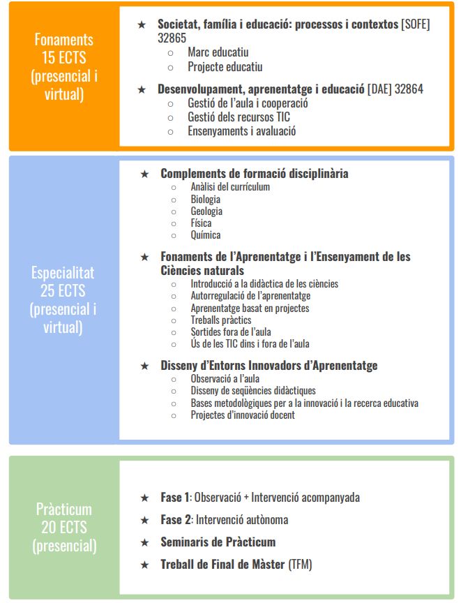

## Información General

* El objetivo del máster de profesorado de la UPF es formar profesionales competentes y preparados para los retos actuales y futuros de la educación. A lo largo del curso, trabajarás las competencias clave para ser docente y revisarás y madurarás tanto las concepciones sobre la enseñanza-aprendizaje como la naturaleza del conocimiento de tu especialidad, compartiendo la experiencia con los compañeros de curso.

* Este máster tiene un enfoque globalizado y holístico, con un aprendizaje experiencial, colaborativo y basado en la práctica reflexiva. La participación en el prácticum en centros y el acompañamiento de los mentores son una pieza clave del crecimiento profesional, complementado con las clases en la universidad, en línea y presenciales.

* Estos son los siete ámbitos competenciales que trabajarás de manera transversal en las diferentes asignaturas. Como máster profesionalizador, estos ámbitos abarcan los diversos aspectos de la tarea docente: la comunicación, la gestión, la orientación, la investigación y la reflexión sobre la práctica personal, además del diseño de las secuencias de aprendizaje de los aprendices. Las pruebas de la adquisición de estas competencias se recogerán en los proyectos y en las actividades que harás en las asignaturas, en el portafolio del prácticum y en el trabajo de fin de máster.

{width=50% fig-align="center" group="intro-master-upf"}

{width=50% fig-align="center" group="intro-master-upf"}

{width=50% fig-align="center" group="intro-master-upf"}

{width=50% fig-align="center" group="intro-master-upf"}

## Créditos y dedicación

* Cada ECTS (European Credit Transfer System) corresponde aproximadamente a 25 horas de trabajo (en el aula presencial o virtual y de manera autónoma)

* El total del máster corresponde a unas 1.500 horas de dedicación

* Se puede cursar el máster en uno o dos años, según las circunstancias personales o laborales

## Participación

* En todas las asignaturas es necesario participar de manera constante en las actividades, trabajo personal, colaboración en equipo (dentro y fuera del aula), y puntualidad en la entrega de las tareas
* En las especialidades de Ciencias Naturales, Inglés y Catalán-Castellano es necesario asistir a un mínimo del 85% de las horas presenciales, en todas las asignaturas y en el Prácticum.

## Evaluación

* La calificación final del máster se basa en el número de créditos asignado a cada módulo, tal como se muestra en el esquema anterior: 15 créditos de Fundamentos, 25 créditos de Especialidad y 20 créditos de Prácticum

* Para superar el máster es necesario aprobar TODAS las asignaturas de Fundamentos, de Especialidad, el Prácticum y el trabajo final de máster (TFM)

* En caso de hacer uso de la Inteligencia Artificial Generativa (IAG) para elaborar algún fragmento, imagen, actividad, etc., es necesario mencionarlo explícitamente, escribiendo un apartado específico en la bibliografía donde se explique el uso realizado de la IAG y referenciar estas partes siguiendo las directrices de la APA al respecto (Puede encontrar esta información en la web del CRAI de la UPF y, en especial, el apartado de citación para estos casos). En caso de mal uso de la IAG se considerará suspendida la tarea o trabajo correspondiente.

## Prácticum

* La universidad coordina con los centros la asignación de los estudiantes y asigna a cada uno un mentor (un profesor voluntario del centro, de la especialización correspondiente) y un tutor de la universidad

* Los estudiantes que tengan alguna relación laboral o personal con algún centro no pueden cursar en él el Prácticum

## Profesorado

* Pineda Badia, Bernat Blasco, Arturo Corts, Marcel Costa, Xavier Muñoz, Lluís Pagès, Gemma Viscasillas, Anna Torras, Gemma Serra, Jordi Soler, Jordi de Manuel, Anama Domènech, Sílvia Marro, Iván Marchán, Lluís Terrado, Laura Taberner, Xavier Oller, Teresa Martínez, Núria Domènech, Laura Farr, Jessica Fernández, Laura Ganzer, Davínia Hernández-Leo, Sílvia Lope, Laia Ramon, Diego Sanjulian.