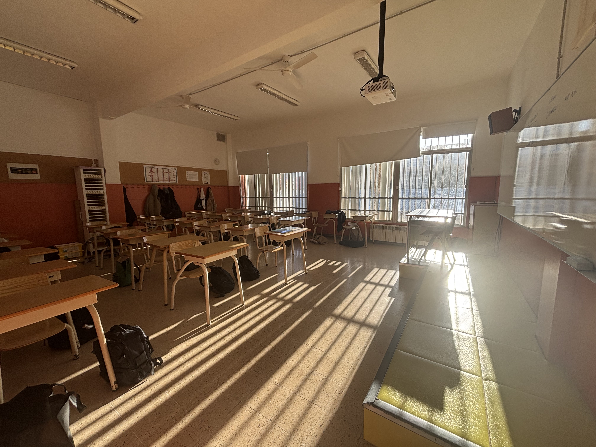

# Bienvenido al Portfolio de Pedro Martínez Durán

Este es el portfolio donde se recogen las reflexiones sobre las 3 primeras semanas de observación en el centro educativo el colegio San Gabriel de Viladecans.

## Descripción del centro y la actividad didáctica de mi mentor
Mi centro de prácticas, el colegio concertado "Los Gabrielistas" se encuentra en la localidad de Viladecans. Mi mentor de prácticas se llama Carlos Giménez Esteban y es licenciado en biología con 35 años de experiencia docente, todos ellos en este mismo colegio.

La actividad educativa de Carlos se concentra en 4 de ESO y principalmente bachillerato. De 4 de ESO solo imparte cultura científica y en los 2 cursos de bachillerato se encarga de las asignaturas las relacionadas con biología, las matemáticas de 2 de bachillerato, y retos científicos actuales de biologia-geologia. Los dos últimos días de la primera semana y los 2 primeros de la segunda semana de prácticas coincidieron con los exámenes del primer trimestre y el miércoles siguiente fue la excursión de las clases de bachillerato después de los exámenes. Esto ha implicado que, durante esos días las clases fueron enfocadas a repasar y preparar los exámenes, lo que hizo que las dinámicas fueran muy diferentes a las habituales.

## Mis intervenciones como observador

La verdad es que en esta fase de observación, salvo que me invitara Carlos a aportar más información a lo que estaba explicando, yo me he limitado a estar en la reguardia de clase observando y tomando notas. Mas o menos habré intervenido unas 10 veces, añadiendo comentarios o explicaciones extras que Carlos estaba dando en clase. Aparte de estas intervenciones puntuales, he ayudado a vigilar exámenes durante esos 4 días de trimestrales y si que he interaccionado bastante con los profesores de bachillerato ya que la actividad de Carlos en las clases de la ESO se limitaba a la asignatura de cultura científica de 4 de la ESO.

La verdad es que este hecho es el único punto "no óptimo" que le puedo poner a las prácticas ya que me limita la experiencia de interacción con el resto del profesorado a unas 5 personas con las que he tenido contacto directo dentro de la sala de profesores de bachillerato. La única interacción con los profesores de la ESO fue cuando fui al claustro conjunto de profesores de la ESO y bachillerato, pero se debatió sobre todo los problemas de ciertos alumnos de la FP básica.

## Mis impresiones de estas 3 semanas

Una cosa que me gustó mucho fue que Carlos me preguntara cómo me encontraba al acabar el segundo día, y luego me volvió a preguntar al final de la primera semana. El sentir que se preocupaba de cómo me sentía en mis primeros días me gustó. Además, tengo que decir que ha habido entre mi mentor y yo una química muy buena, con inquietudes vitales muy parecidas y esto ayuda bastante. En relación con los alumnos, tengo que decir que la complejidad es casi inexistente o diría que nula. La diversidad racial es muy limitada o anecdótica con un rumano y una chica de Moldavia en 2 de bachillerato y una niña china en 4 de ESO. En los 3 casos, la integración tanto a nivel idiomático, relación con los otros alumnos es total, y los 3 son buenos estudiantes. Por tanto, esta complejidad casi nula, sin problemas de integración y ausencia de alumnos con algún problema cognitivo o de comportamiento ha derivado a clases tranquilas sin nada que subrayar. En general, los alumnos están atendiendo, tomando notas, y sin nada que reseñar salvo 4 o 5 veces que Carlos ha tenido que llamar la atención, siempre de manera anónima y sin necesidad de repetir la llamada de atención. Solamente 1 vez ha repetido Carlos la llamada de atención con amenaza de echarla de clase. Todas estas llamadas de atención se han centrado en bachillerato, más en 2 de bachillerato, mientras que el grupo de 4 ESO se podría definir como ejemplar.

Dentro de estas aulas tranquilas, sí que me gustaría destacar 2 cosas que me han llamado la atención. Una es la [inmiscibilidad entre sexos]{style="font-weight: bold;"} que ocurre tanto en bachillerato como en la ESO, aunque es más marcado a mayor edad, 2 de bachillerato. Cuando se sientan en parejas, siempre se sientan chicas con chicas y viceversa y cuando la disposición de los pupitres es más flexible `(esto ocurre en las asignaturas optativas)`, se sientan agrupándose por sexos. La otra circunstancia que me ha llamado la atención y que solo he descrito en bachillerato es el [uso del portátil]{style="font-weight: bold;"} cuando no es estrictamente necesario y puede implicar que el alumno puede estar distraído haciendo otras cosas. Esta circunstancia ocurre más en 2 de bachillerato que en primero.

En relación con estos 2 puntos, he pensado que, para mis situaciones de aprendizaje, los grupos de trabajo los diseñaré yo mismo para crear grupos heterogéneos mezclando a los alumnos por sexos. Con ayuda de Carlos también incluiré el parámetro de rendimiento académico de cada alumno para equilibrar los grupos por el lado cognitivo. Y en relación con los portátiles, pediré a los alumnos que cuando no sea estrictamente necesario que guarden los portátiles fuera de la mesa para evitar despistes. Tengo mis dudas de utilizar alguna técnica de control del aula para comenzar las clases que nos han explicado en el máster ya que por mi experiencia de estas 3 semanas no veo la necesidad de aplicar esas rutinas tan explícitas, aunque sí que me gustaría alguna rutina más sutil o digamos no tan descarada como las que nos han explicado.

## Plan para la fase de intervención

Para acabar, ya hemos consensuado Carlos y yo qué actuaciones didácticas realizaré durante la fase de intervención que durará 7 semanas desde mediados de Febrero a mediados de Abril del 2026. Estas serán las siguientes:

| 4º ESO | 2º Bachillerato |
| --- | --- |
|Para [4 de la ESO]{style="font-weight: bold;"}, realizaré el punto [La Tierra en el Universo](#) incluido en la asignatura Biologia y Geologia. Descripción del origen del universo y su relación con los astros que componen el sistema solar. Análisis y comparación de las hipótesis sobre el origen de la vida, argumentos. Discusión sobre las investigaciones principales en el campo de la astrobiología. | Para [2º de bachillerato]{style="font-weight: bold;"}, la situación de aprendizaje es la [materia optativa trimestral de objetivos de desarrollo sostenible](#). El ODS que se tratará será el objetivo de desarrollo sostenible número 13 “Acción por el clima” que está incluido en el bloque temático de entorno sostenible. En esta actuación concreta, Carlos me ha pedido que en esta didáctica utilice una película o documental y que por parejas hagan una pequeña presentación de las citas del ODS 13, centrando la atención en las implicaciones del cambio climático y la sostenibilidad.

Finalmente, haré una clase en inglés a petición de la profesora de inglés (Montse) sobre cambio climático y las implicaciones geopolíticas y económicas de la reducción del casquete de hielo del polo norte. Por otro lado, me han pedido hacer una intervención de un día a un ciclo formativo de interpretación del paisaje con una excursión a la sierra del Garraf para explicar el porqué de la fisiografía del paisaje desde el punto de vista de la geología.